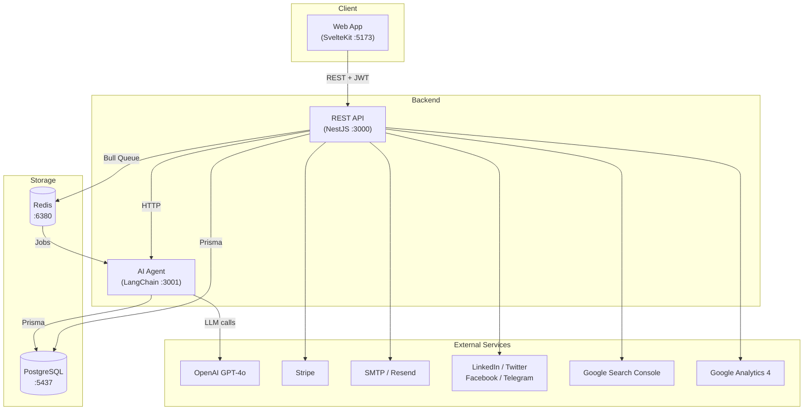
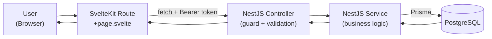
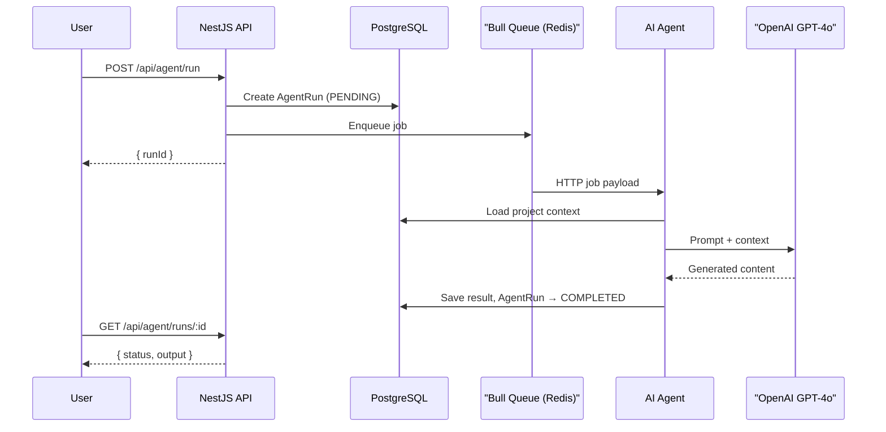
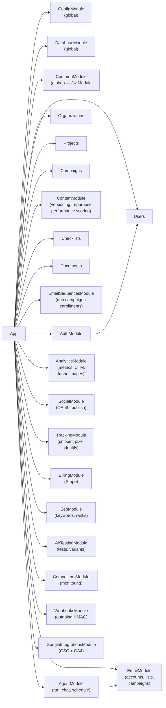
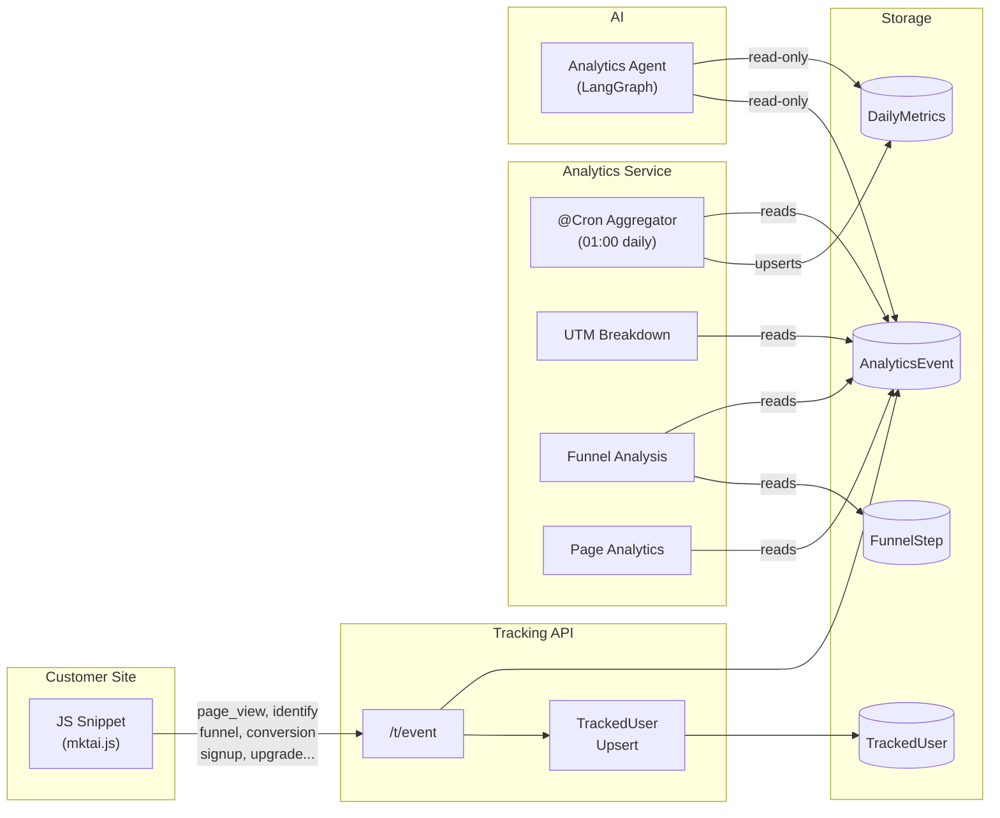
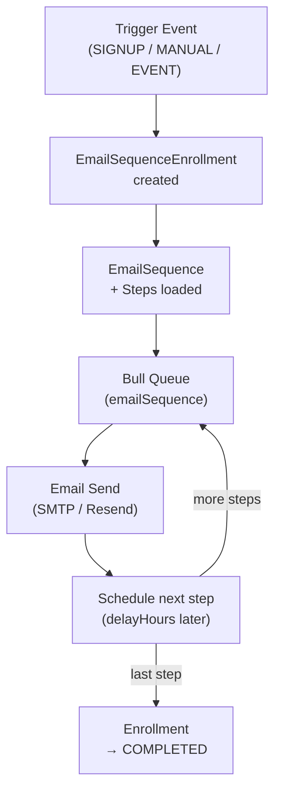

# Architecture Overview

Marketing AI Assistant is a Turborepo + pnpm monorepo with three apps and five shared packages, purpose-built for SaaS and web application marketing teams.

## Project Structure

```
marketing-ai-assistant/
├── apps/
│   ├── api/            # NestJS REST API (port 3000)
│   ├── web/            # SvelteKit frontend (port 5173)
│   └── ai-agent/       # LangChain/LangGraph microservice (port 3001)
├── packages/
│   ├── shared-types/   # TypeScript interfaces & enums
│   ├── database/       # Prisma schema, client, seed
│   ├── i18n/           # EN/PL/RU locale files
│   ├── email-templates/# Email component templates
│   └── config/         # Shared tsconfig, eslint, constants
├── docker-compose.yml  # PostgreSQL, Redis, MailHog
├── turbo.json          # Turbo pipeline configuration
├── pnpm-workspace.yaml # Workspace definition
└── .env.example        # Environment variable template
```

## Technology Stack

| Layer | Technology |
|-------|-----------|
| Frontend | SvelteKit 2, Svelte 5, TailwindCSS 3, svelte-i18n |
| Backend API | NestJS 10, Express (Helmet, Compression, CORS) |
| Database | PostgreSQL 16, Prisma ORM 6 |
| Job Queue | Bull 4, Redis 7 |
| AI/LLM | OpenAI GPT-4o, LangChain, LangGraph, LangSmith |
| Auth | Passport.js (JWT, Local, Google OAuth 2.0), bcrypt |
| Email | Nodemailer (SMTP), Resend API |
| Billing | Stripe (Checkout, Portal, Webhooks) |
| File Storage | AWS S3 (optional) |
| Validation | class-validator, Zod |
| Testing | Jest, Vitest |
| Build | Turborepo, pnpm, TypeScript 5, Vite 6 |
| DevOps | Docker Compose, MailHog |

## Application Architecture

### High-Level Diagram



### Communication Patterns

1. **Web ↔ API** — REST over HTTP with JWT Bearer authentication (15-min access token + 7-day refresh token in HttpOnly cookies)
2. **API → AI Agent** — Bull queue dispatches jobs; worker calls AI Agent over HTTP
3. **API → PostgreSQL** — Prisma ORM with connection pooling via `globalForPrisma` singleton
4. **API → Redis** — Bull job queue for async agent task processing
5. **API → Stripe** — Payment processing via Stripe SDK
6. **API → SMTP/Resend** — Transactional and bulk email delivery
7. **API → Social Platforms** — LinkedIn OAuth2, Twitter API v2, Facebook Graph API v19, Telegram Bot API
8. **API → Google Services** — Search Console API (SEO data), GA4 Data API (web analytics)

### Data Flow



### AI Agent Flow



## Module Dependency Graph



## Feature Modules Overview

| Module | Path | Description |
|--------|------|-------------|
| Auth | `src/auth/` | JWT, Local, Google OAuth strategies |
| Users | `src/users/` | Profile management |
| Organizations | `src/organizations/` | Multi-tenant orgs, member roles (OWNER/ADMIN/MEMBER) |
| Projects | `src/projects/` | Project CRUD, API keys, websiteUrl for SEO |
| Campaigns | `src/campaigns/` | Marketing campaigns (EMAIL/SOCIAL/BLOG/MULTI_CHANNEL) |
| Content | `src/content/` | Content CRUD, versioning, repurposing, performance scoring |
| Email | `src/email/` | Accounts (SMTP/Resend), lists, subscribers, one-off campaigns |
| Email Sequences | `src/email-sequences/` | Drip campaigns with SIGNUP/MANUAL/EVENT triggers and enrollment |
| Checklists | `src/checklists/` | Task checklists with LOW/MEDIUM/HIGH/CRITICAL priorities |
| Documents | `src/documents/` | Structured marketing documents (plans, reports, briefs) |
| Agent | `src/agent/` | AI agent runs, interactive chat, schedule management |
| Analytics | `src/analytics/` | Daily metrics, UTM attribution, conversion funnel, page analytics |
| Social | `src/social/` | Social account OAuth + manual connections, content publishing |
| Tracking | `src/tracking/` | JS snippet, pixel GIF, event ingestion, user identification |
| Billing | `src/billing/` | Stripe subscriptions and webhooks |
| SEO | `src/seo/` | Keyword tracking with rank history time-series |
| A/B Testing | `src/ab-testing/` | Email subject line and content variant experiments |
| Competitors | `src/competitors/` | Competitor URLs, periodic snapshots, change monitoring |
| Webhooks | `src/webhooks/` | Outgoing webhooks with HMAC-SHA256 signature verification |
| Google Integrations | `src/google-integrations/` | Google Search Console + GA4 data import |

## Tracking & Analytics Data Flow



## Email Automation Data Flow



## Shared Packages

| Package | Purpose |
|---------|---------|
| `@marketing-ai/shared-types` | TypeScript interfaces, enums, DTOs shared across all apps |
| `@marketing-ai/database` | Prisma schema + `globalForPrisma` singleton client + seed script |
| `@marketing-ai/i18n` | EN/PL/RU locale JSON files consumed by SvelteKit |
| `@marketing-ai/email-templates` | Reusable email HTML templates |
| `@marketing-ai/config` | `tsconfig.base.json`, `eslint.config.js`, shared constants |
