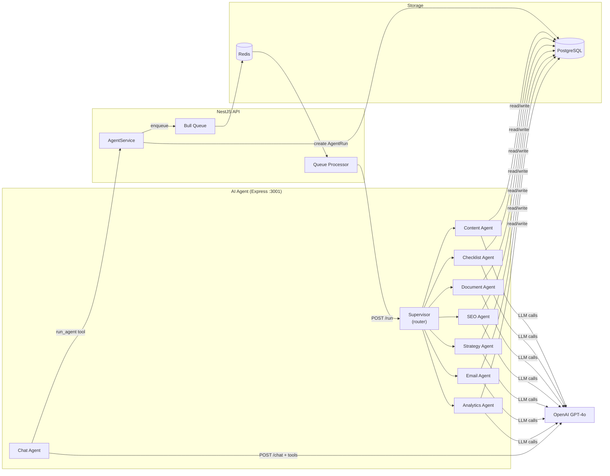
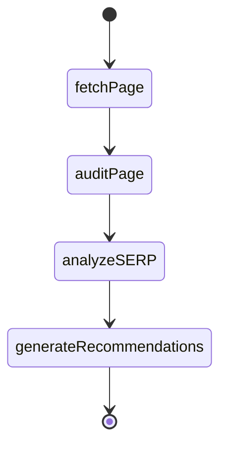
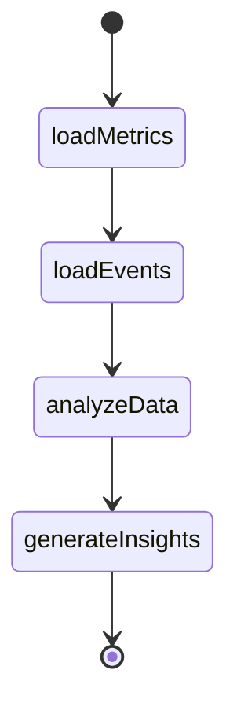
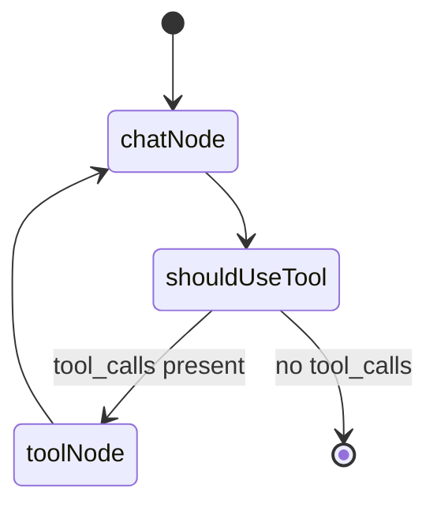

# AI Agent System

## Overview

The AI Agent system is a standalone Express.js microservice (`apps/ai-agent`) that uses **LangChain**, **LangGraph**, and **OpenAI GPT-4o** to generate marketing content, run SEO audits, provide analytics insights, and power an interactive chat assistant.

## Architecture



### Request Flow

1. Client calls `POST /api/agent/run` with `{ projectId, agentType, input }`
2. API creates `AgentRun` record in DB (status: `PENDING`)
3. Job added to Bull queue (Redis-backed)
4. Queue processor sends HTTP request to AI Agent microservice at `POST /run`
5. Supervisor routes to the correct agent based on `agentType`
6. Agent loads project context from DB
7. LangChain/LangGraph processes request via OpenAI GPT-4o
8. Result saved to DB; `AgentRun` updated to `COMPLETED`

## Agent Types

### Content Agent

**File:** `apps/ai-agent/src/agents/content-agent.ts`

Generates marketing content for all supported formats and platforms.

**Input:**
```json
{
  "type": "SOCIAL_POST | BLOG_ARTICLE | EMAIL | NEWSLETTER | AD_COPY | LANDING_PAGE | SEO_ARTICLE | REFERRAL_COPY | IN_APP_MESSAGE",
  "platform": "TWITTER | LINKEDIN | FACEBOOK | INSTAGRAM",
  "topic": "Product launch announcement",
  "keywords": ["innovation", "tech", "launch"],
  "tone": "professional | casual | humorous | formal",
  "length": "short | medium | long"
}
```

**Behavior:**
- Loads project context (name, description, target audience, brand voice, industry)
- For `SEO_ARTICLE`: performs SERP analysis, outputs `metaTitle`, `metaDescription`, `suggestedSlug`, `keywordDensity`
- For `LANDING_PAGE`: structured JSON output (hero, features, social proof, pricing CTA, FAQ)
- Model: GPT-4o, temperature: 0.8
- Creates Content record in database with `seoMetadata` field populated for SEO articles

### Checklist Agent

**File:** `apps/ai-agent/src/agents/checklist-agent.ts`

Generates detailed task checklists for marketing activities.

**Input:**
```json
{
  "type": "LAUNCH | WEEKLY | CAMPAIGN_PREP | SEO | SOCIAL_MEDIA | EMAIL_CAMPAIGN | PRODUCT_HUNT_LAUNCH",
  "language": "en | pl | ru",
  "context": "Optional additional context"
}
```

**Behavior:**
- Generates 25-35 items grouped into 4-6 sections
- Each item has a 6-10 sentence description: specific steps, tools, metrics, common mistakes
- Priorities: CRITICAL (4-6 items), HIGH (8-10), MEDIUM, LOW
- `maxTokens: 16384`, temperature: 0.3
- Language support via `getLanguageInstruction(language)`
- LangGraph flow: `loadContext → generateChecklist → parseJson → [fixJson] → saveChecklist`
- Creates Checklist + ChecklistItem records in DB

### Document Agent

**File:** `apps/ai-agent/src/agents/document-agent.ts`

Generates marketing documents in Markdown format.

**Input:**
```json
{
  "type": "MARKETING_PLAN | REPORT | COMPETITIVE_ANALYSIS | BRAND_GUIDELINES | CONTENT_CALENDAR | PRODUCT_HUNT_BRIEF",
  "language": "en | pl | ru",
  "title": "Performance Report",
  "context": "Optional additional context"
}
```

**Behavior:**
- `maxTokens: 8192`, temperature: 0.4
- For `REPORT` type, loads real project data from DB:
  - Content (statuses, types, recent entries)
  - Campaigns (statuses)
  - Email subscribers (count)
  - Connected social accounts
  - Checklists (task completion %)
- AI is instructed to use **only real data**, not invent metrics
- If data is missing, states "no data available" and recommends what to set up
- `PRODUCT_HUNT_BRIEF` output includes: tagline, description, maker comment, launch-day social posts
- Creates Document record in DB

### Templates Page Integration

The `/templates` page uses CHECKLIST and DOCUMENT agents:
- Frontend sends `POST /agent/run` with `agentType`, `input.type`, `input.language` (from `$locale`)
- Polls `GET /agent/runs/:id` every 2 seconds until `COMPLETED`
- Shows generation overlay with animation (30-60 seconds)
- Redirects to checklists/documents page on completion

### SEO Agent

**File:** `apps/ai-agent/src/agents/seo-agent.ts`

Performs on-page SEO audits and competitor SERP analysis using LangGraph state machine.

**Input:**
```json
{
  "url": "https://example.com",
  "keywords": ["saas marketing", "b2b growth"],
  "competitorUrls": ["https://competitor1.com"]
}
```

**LangGraph State Flow:**



**Output:**
- Page title, meta description, H1/H2 structure
- Keyword density analysis
- SERP competitor comparison
- Prioritized optimization recommendations
- `suggestedSlug`, `metaTitle`, `metaDescription` for new content

### Strategy Agent

**File:** `apps/ai-agent/src/agents/strategy-agent.ts`

Generates go-to-market strategies and marketing plans.

**Input:**
```json
{
  "type": "GTM | POSITIONING | PRODUCT_HUNT | PRICING",
  "topic": "SaaS product launch strategy",
  "additionalContext": "B2B, enterprise segment"
}
```

**Behavior:**
- Generates structured Document (MARKETING_PLAN or PROPOSAL type)
- Covers: positioning, competitive landscape, channel strategy, budget allocation, KPIs
- Patterns: similar to document-agent but with strategy-specific system prompts

### Email Agent

**File:** `apps/ai-agent/src/agents/email-agent.ts`

Generates email marketing copy and complete drip sequences.

**Input:**
```json
{
  "type": "SUBJECT_LINE | CAMPAIGN_EMAIL | SEQUENCE",
  "topic": "SaaS onboarding sequence",
  "sequenceLength": 5,
  "tone": "friendly"
}
```

**Behavior:**
- `SUBJECT_LINE`: generates multiple A/B test variants with predicted open rates
- `CAMPAIGN_EMAIL`: full email copy (subject + preheader + body + CTA)
- `SEQUENCE`: generates a complete drip sequence (N emails with timing suggestions)

### Analytics Agent

**File:** `apps/ai-agent/src/agents/analytics-agent.ts`

Analyzes marketing performance data and generates natural-language insights.

**Input:**
```json
{
  "query": "Why did traffic drop last week?",
  "projectId": "clx...",
  "days": 30
}
```

**LangGraph State Flow:**



**Behavior:**
- Read-only Prisma queries to `DailyMetrics` and `AnalyticsEvent`
- Trend analysis, channel comparison, anomaly detection
- Generates weekly digest reports
- Responds in natural language to free-form marketing questions

### Chat Agent

**File:** `apps/ai-agent/src/agents/chat-agent.ts`

Interactive AI marketing assistant with tool-calling capabilities.

**Input:**
```json
{
  "message": "Create a launch checklist for my product",
  "projectId": "clx...",
  "userId": "clx...",
  "history": [
    { "role": "user", "content": "..." },
    { "role": "assistant", "content": "..." }
  ]
}
```

**LangGraph State Flow:**



**Tool: `run_agent`**

The chat agent can dispatch any specialized agent directly from conversation:

| Field | Type | Description |
|-------|------|-------------|
| agentType | enum | CONTENT, CHECKLIST, DOCUMENT, STRATEGY, SEO, EMAIL, ANALYTICS |
| topic | string? | Main topic or subject |
| type | string? | Subtype (e.g. SOCIAL_POST, LAUNCH, GO_TO_MARKET) |
| platform | string? | Target platform (LINKEDIN, TWITTER, etc.) |
| description | string? | Detailed instructions |
| language | string? | Output language (en, pl, ru) |

The tool calls `POST /api/agent/run-internal` with `X-Agent-Secret` header and returns a confirmation with a direct link to the results page.

**Behavior:**
- Model: GPT-4o, temperature: 0.7
- Loads project context if `projectId` provided
- Tool-calling loop: OpenAI decides when to use the `run_agent` tool
- Supports EN/PL/RU multilingual responses (both chat and agent output)
- Maintains conversation history from client
- Messages support Markdown rendering in the frontend

### Supervisor

**File:** `apps/ai-agent/src/agents/supervisor.ts`

Task dispatcher that routes requests to the correct agent.

- Receives `{ runId, projectId, agentType, input }`
- Routes to appropriate agent based on `agentType`
- Times execution duration
- Tracks token usage and estimated cost in USD
- Updates `AgentRun` record in DB with output, duration, tokensUsed, cost

## Configuration

### Environment Variables

```env
# Required
OPENAI_API_KEY="sk-your-openai-api-key"

# Optional
OPENAI_MODEL="gpt-4o"
AI_AGENT_PORT="3001"

# LangSmith tracing (optional but recommended)
LANGSMITH_API_KEY="your-langsmith-api-key"
LANGSMITH_PROJECT="marketing-ai-assistant"
LANGCHAIN_TRACING_V2="true"
LANGCHAIN_ENDPOINT="https://api.smith.langchain.com"

# Internal agent dispatch
AGENT_SECRET="your-secret-key"    # Shared secret for internal agent dispatch from chat
```

### Dependencies

| Package | Purpose |
|---------|---------|
| `@langchain/core` | Base messaging (HumanMessage, SystemMessage, AIMessage) |
| `@langchain/openai` | ChatOpenAI model wrapper |
| `@langchain/langgraph` | Graph-based agent state machines |
| `@langchain/community` | TavilySearch, CheerioWebBaseLoader for SEO agent |
| `langsmith` | Execution tracing and cost monitoring |

## API Endpoints (AI Agent microservice)

### POST `/run`

Execute an agent task.

**Request:**
```json
{
  "runId": "clx...",
  "projectId": "clx...",
  "agentType": "CONTENT",
  "input": { ... }
}
```

**Response:**
```json
{
  "runId": "clx...",
  "output": { ... },
  "duration": 3500,
  "tokensUsed": 1250,
  "cost": 0.0375
}
```

### POST `/chat`

Interactive chat with AI assistant.

**Request:**
```json
{
  "message": "Create a checklist for product launch",
  "projectId": "clx...",
  "userId": "clx...",
  "history": []
}
```

**Response:**
```json
{
  "message": "For email marketing, I'd recommend...",
  "role": "assistant",
  "timestamp": "2026-03-01T10:35:00Z"
}
```

### GET `/health`

**Response:**
```json
{ "status": "ok", "timestamp": "2026-03-01T10:30:00Z" }
```

## Cost Tracking

Each `AgentRun` record stores:
- **tokensUsed** — total input + output tokens consumed
- **cost** — estimated cost in USD (based on GPT-4o pricing)
- **duration** — execution time in milliseconds
- **langsmithTraceUrl** — link to LangSmith trace for debugging

## Scheduled Runs

The `AgentSchedule` model enables cron-based automation:
- Define a cron expression per project per agent type
- Default input parameters stored with the schedule
- `isActive` flag to enable/disable
- `lastRunAt` / `nextRunAt` for tracking
- Processor checks `isActive && nextRunAt <= now()` on each @Cron tick
