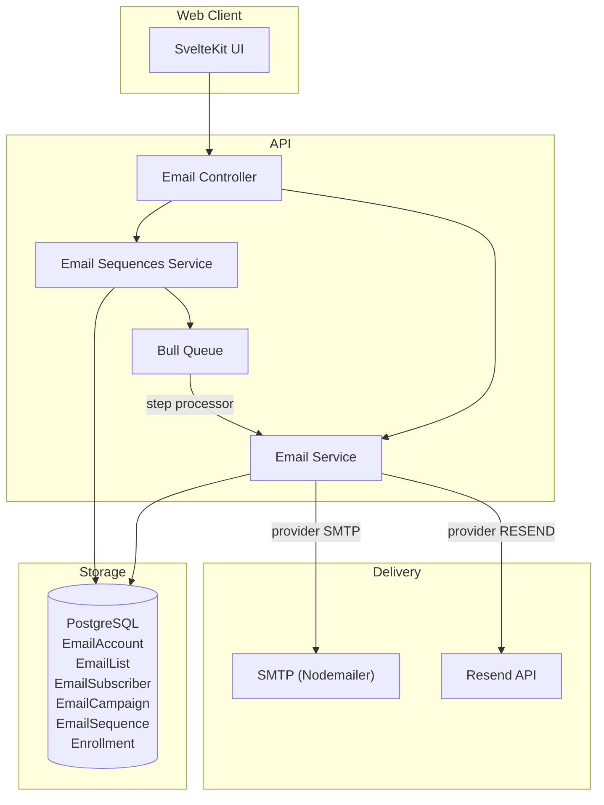
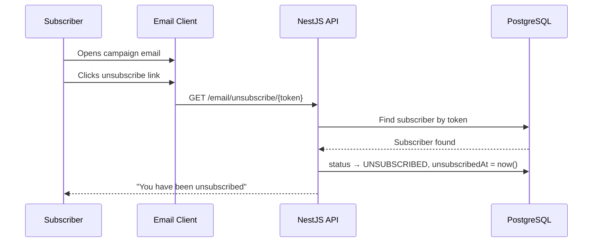
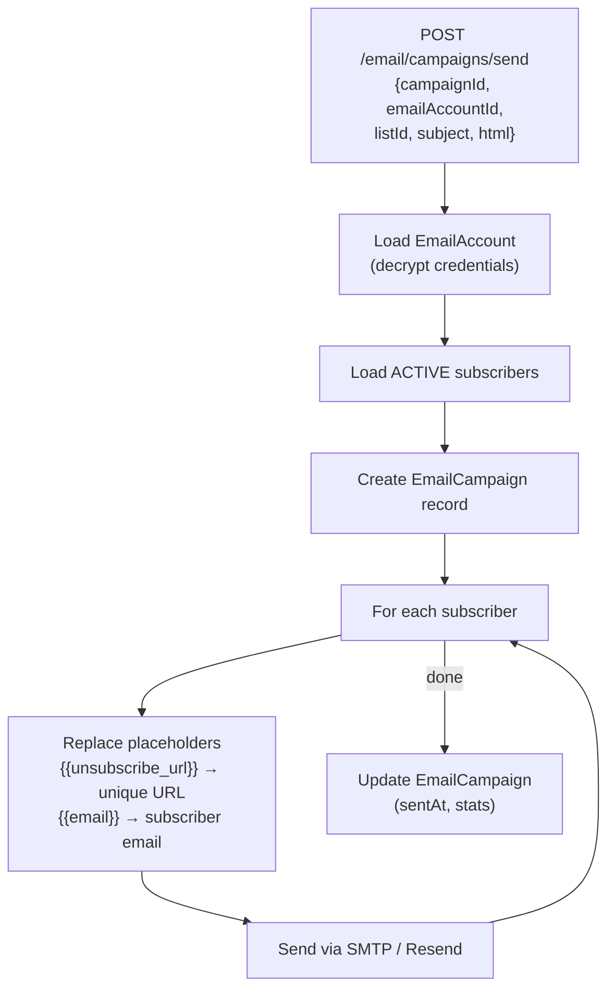
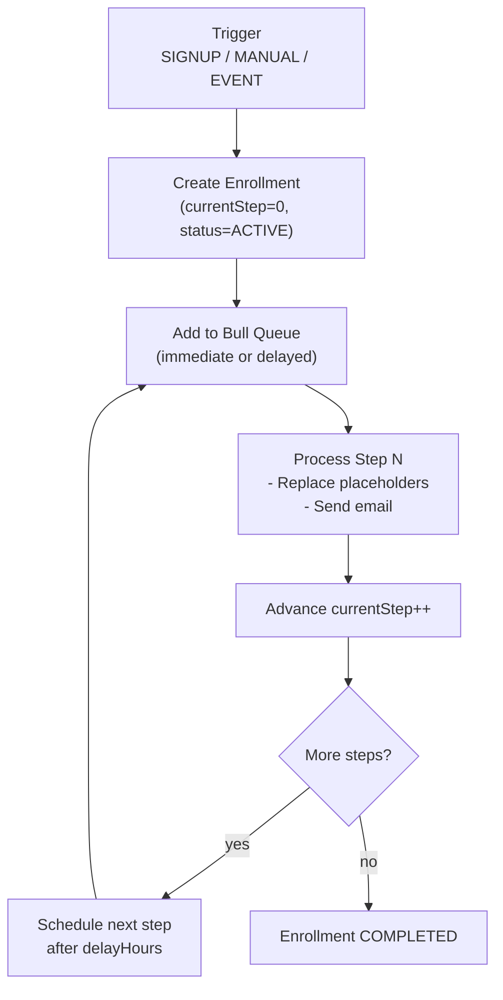

# Email Marketing System

## Overview

The email system supports two providers (**SMTP** and **Resend**), subscriber list management, one-time campaign sending with placeholder replacement, automated drip sequences, and one-click unsubscribe.

## Architecture



## API Routes

| Method | Route | Auth | Description |
|--------|-------|------|-------------|
| GET | `/email/accounts?organizationId=<id>` | Protected | List email accounts |
| POST | `/email/accounts` | Protected | Create email account |
| DELETE | `/email/accounts/:id` | Protected | Delete email account |
| POST | `/email/accounts/:id/test` | Protected | Test connection |
| GET | `/email/lists?projectId=<id>` | Protected | List subscriber lists |
| POST | `/email/lists` | Protected | Create list |
| DELETE | `/email/lists/:id` | Protected | Delete list |
| GET | `/email/lists/:listId/subscribers` | Protected | Get subscribers |
| POST | `/email/lists/:listId/subscribers` | Protected | Add/upsert subscriber |
| DELETE | `/email/lists/:listId/subscribers/:id` | Protected | Remove subscriber |
| GET | `/email/unsubscribe/:token` | **Public** | Unsubscribe via token |
| GET | `/email/campaigns?projectId=<id>` | Protected | List email campaigns |
| POST | `/email/campaigns/send` | Protected | Send campaign |
| POST | `/email/sequences` | Protected | Create sequence |
| GET | `/email/sequences?projectId=<id>` | Protected | List sequences |
| GET | `/email/sequences/:id` | Protected | Get sequence with steps |
| PUT | `/email/sequences/:id` | Protected | Update sequence |
| DELETE | `/email/sequences/:id` | Protected | Delete sequence |
| POST | `/email/sequences/:id/enroll` | Protected | Enroll subscriber in sequence |

## Email Accounts

### Provider Types

| Provider | Configuration |
|----------|--------------|
| SMTP | host, port, user, password (stored AES-256-CBC encrypted) |
| Resend | API key (stored AES-256-CBC encrypted) |

### Credential Encryption

Credentials are encrypted at rest using **AES-256-CBC**:
- Key: `ENCRYPTION_KEY` environment variable (32-byte hex string)
- Column: `encryptedCredentials`
- Decrypted on-the-fly when sending emails

## Subscriber Management

### Statuses

| Status | Description |
|--------|-------------|
| ACTIVE | Subscribed and can receive emails |
| UNSUBSCRIBED | User opted out via unsubscribe link |
| BOUNCED | Email delivery permanently failed |

### Unsubscribe Flow



## Campaign Sending

### Send Flow



### Template Placeholders

| Placeholder | Replaced With |
|-------------|---------------|
| `{{unsubscribe_url}}` | `{API_URL}/email/unsubscribe/{token}` |
| `{{email}}` | Subscriber's email address |

## Email Sequences (Drip Campaigns)

Email sequences enable automated multi-step email flows triggered by subscriber events.

### Sequence Flow



### Trigger Types

| Trigger | Description |
|---------|-------------|
| SIGNUP | Automatically enrolls new subscribers on list join |
| MANUAL | Manually enroll specific subscribers |
| EVENT | Triggered by an analytics event (e.g., TRIAL_START) |

### Built-in Sequence Templates

| Template | Steps | Use Case |
|----------|-------|----------|
| Welcome Series | 5 emails | New user onboarding |
| Trial Nurture | 7 emails | Convert trial to paid |
| Re-engagement | 3 emails | Win back inactive users |

### Sequence Example

```json
{
  "name": "Trial Nurture",
  "trigger": "SIGNUP",
  "steps": [
    { "order": 1, "subject": "Welcome to [Product]!", "delayHours": 0 },
    { "order": 2, "subject": "Get started in 5 minutes", "delayHours": 24 },
    { "order": 3, "subject": "Key feature you might have missed", "delayHours": 72 },
    { "order": 4, "subject": "Your trial ends in 3 days", "delayHours": 168 },
    { "order": 5, "subject": "Last chance — upgrade now", "delayHours": 240 }
  ]
}
```

## Development Setup

### MailHog (Local SMTP)

Included in `docker-compose.yml` for local email testing:

- **SMTP port:** 1025
- **Web UI:** http://localhost:8025

All emails sent in development are captured and viewable in the MailHog web UI.

### Configuration

```env
# SMTP (development — MailHog)
SMTP_HOST="localhost"
SMTP_PORT="1025"
SMTP_SECURE="false"
SMTP_USER=""
SMTP_PASS=""

# Resend (production)
RESEND_API_KEY="re_your-resend-api-key"
RESEND_FROM_EMAIL="noreply@yourdomain.com"

# Encryption key for email account credentials (32-byte hex)
ENCRYPTION_KEY="0000000000000000000000000000000000000000000000000000000000000000"
```
