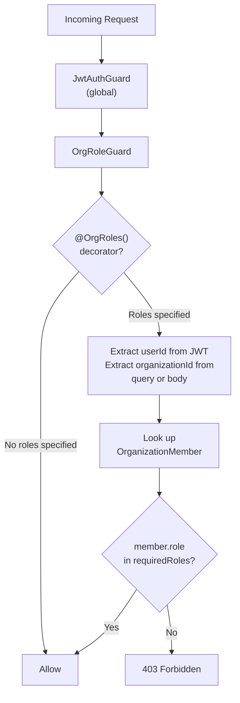
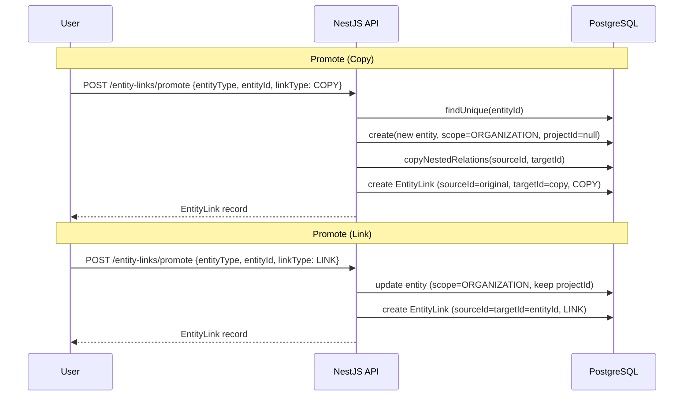

# Organization-Level Marketing Sections

## Overview

Organization-level marketing sections extend every core marketing feature -- Content, Checklists, Documents, Campaigns, Email, Analytics, SEO, Competitors, Experiments, Sequences, and Calendar -- beyond individual projects to the organization level. This enables cross-project visibility, centralized content management, and aggregated analytics across all projects within an organization.

Key capabilities:

- **Organization-scoped entities** that exist independently of any project
- **Aggregated dashboards** showing data across all projects
- **Bidirectional promote/demote** between project and organization scopes (copy or link)
- **Comparison analytics** across projects
- **Role-based access** controlling visibility by organization role

---

## User Guide

### Navigating Organization Sections

The sidebar is organized into three tiers: top-level navigation, organization marketing sections, and per-project sections.

```
Organization Name (switcher)
|
+-- Dashboard
+-- Projects
+-- AI Chat
+-- Templates
|
+-- MARKETING (org-level)
|   +-- Content
|   +-- Checklists
|   +-- Documents
|   +-- Campaigns
|   +-- Email
|   +-- Analytics
|   +-- SEO
|   +-- Competitors
|   +-- Experiments
|   +-- Sequences
|   +-- Calendar
|
+-- PROJECTS
|   +-- [selected project]
|       +-- Overview
|       +-- Content
|       +-- Checklists
|       +-- Email
|       +-- Campaigns
|       +-- Advanced
|           +-- Documents
|           +-- Analytics
|           +-- SEO
|           +-- Experiments
|           +-- Sequences
|           +-- Competitors
|           +-- Calendar
|       +-- Settings
|
+-- SETTINGS
    +-- Organization
    +-- Billing
    +-- Team
    +-- Email Accounts
    +-- Integrations
    +-- Webhooks
```

Organization sections live at top-level routes (`/content`, `/analytics`, `/calendar`, etc.), while project sections are nested under `/projects/[id]/content`, `/projects/[id]/analytics`, etc.

### Organization vs Project Scope

Every marketing entity has a **scope** field with two possible values:

| Scope | Meaning | `projectId` | `organizationId` |
|-------|---------|-------------|-------------------|
| `PROJECT` | Belongs to a specific project | Required | Required (backfilled) |
| `ORGANIZATION` | Belongs to the organization, not tied to a project | `null` (or set if linked) | Required |

**Project-scoped** entities appear in their project's section and in the organization's "All Projects" aggregated view.

**Organization-scoped** entities appear in the organization section. If linked to a project, they also appear in that project's section.

### Using Organization Tabs

Each organization-level page provides two tabs:

| Tab | Shows | Use case |
|-----|-------|----------|
| **Organization** | Entities with `scope=ORGANIZATION` only | Manage org-wide content, templates, shared resources |
| **All Projects** | Aggregated view: org entities + all project entities | Cross-project overview with project filter (multiselect) |

The **Analytics** page additionally has a **Compare** tab for side-by-side project metric comparison.

### Promoting Content to Organization

To promote a project entity to organization level:

1. Open the entity in a project context (e.g., `/projects/[id]/content`)
2. Click the context menu (three dots) on the entity
3. Select **"Promote to Organization"**
4. Choose the promotion type in the modal:

| Option | Behavior |
|--------|----------|
| **Copy** | Creates a new independent copy at organization scope. The original stays in the project unchanged. Changes to one do not affect the other. |
| **Link** | The same entity becomes visible in both scopes. The entity's scope changes to `ORGANIZATION` but retains its `projectId`, so it appears in both views. |

5. Confirm the action

After promotion, an `EntityLink` record is created to track the relationship.

### Assigning Organization Content to Projects

To assign an organization entity to a project:

1. Open the entity in an organization context (e.g., `/content`)
2. Click the context menu on the entity
3. Select **"Assign to Project"**
4. Choose the target project from the dropdown
5. Choose **Copy** or **Link** (same semantics as promote, but in reverse)
6. Confirm the action

### Unlinking Entities

To remove a link between scopes:

1. Find the linked entity (identified by a link badge icon)
2. Click the context menu and select **"Unlink"**

The behavior depends on the link type:

| Link Type | Unlink Behavior |
|-----------|-----------------|
| **COPY** | The `EntityLink` record is deleted. Both copies become fully independent -- no data is deleted. |
| **LINK** | The entity reverts to its original scope. If it was promoted, it returns to `PROJECT` scope. If it was demoted, it returns to `ORGANIZATION` scope with `projectId` cleared. |

### Aggregated Analytics

The organization analytics dashboard (`/analytics`) operates in two modes:

**Summary mode (default):**
- Totals across all projects: content created, emails sent, page views, conversions
- Time-series charts (7d/30d/90d) with per-project lines
- Top performers: best content, best campaign, best email org-wide
- Filterable by period, projects (multiselect), and content type

**Compare mode:**
- Side-by-side project comparison table: projects as rows, metrics as columns
- Metrics include: content count, email open rate, page views, conversions, keyword rankings
- Charts overlay up to 5 projects

### Organization Calendar

The organization calendar (`/calendar`) aggregates scheduled events across all projects:

- Content (by `scheduledAt`), Campaigns (by `startDate`/`endDate`), and Email campaigns
- Color-coded by project; org-scoped entities get a distinct "Organization" color
- Filterable by projects and entity types
- Clicking an event navigates to the entity in its appropriate context

The calendar is a read-only aggregation view, not a separate data model.

### Role-Based Access

| Capability | OWNER / ADMIN | MEMBER |
|------------|---------------|--------|
| View org entities | All | Only those linked/copied to their projects |
| View aggregated data | All projects | Only their projects |
| Promote / Demote | Any entity | Only their own entities in their own projects |
| Compare projects | All projects | Only their projects |
| Create org-scoped entities | Yes | No |
| Delete entity links | Yes | No |

---

## Technical Reference

### Data Model

#### EntityScope Enum

```prisma
enum EntityScope {
  PROJECT
  ORGANIZATION
}
```

Added to all 10 primary marketing models as `scope EntityScope @default(PROJECT)`.

#### Scope Fields

Every primary marketing model gained three changes:

1. `scope EntityScope @default(PROJECT)` -- new field
2. `organizationId String?` -- new field, indexed
3. `projectId String?` -- changed from required to optional

**Validation rules:**

| Scope | `projectId` | `organizationId` |
|-------|-------------|-------------------|
| `PROJECT` | Required | Required |
| `ORGANIZATION` | `null` (unless linked) | Required |

API middleware returns `400 Bad Request` for invalid combinations (`scope=PROJECT` + `projectId=null`, or `scope=ORGANIZATION` + `organizationId=null`).

#### EntityLink Model

```prisma
model EntityLink {
  id          String          @id @default(cuid())
  entityType  EntityModelType
  sourceId    String
  targetId    String
  linkType    EntityLinkType
  sourceScope EntityScope
  targetScope EntityScope
  createdBy   String
  createdAt   DateTime        @default(now())

  creator User @relation(fields: [createdBy], references: [id])

  @@index([entityType, sourceId, targetId])
  @@index([entityType, targetId])
  @@map("entity_links")
}
```

**Link types:**

| Type | `sourceId` | `targetId` | Behavior |
|------|-----------|-----------|----------|
| `COPY` | Original entity ID | New copy ID | Independent entities after creation |
| `LINK` | Entity ID | Same entity ID | Single entity visible in both scopes |

**Entity model types** (10 values in `EntityModelType` enum):
`CONTENT`, `CHECKLIST`, `DOCUMENT`, `CAMPAIGN`, `EMAIL_LIST`, `KEYWORD`, `COMPETITOR`, `ANALYTICS_EVENT`, `AB_TEST`, `EMAIL_SEQUENCE`

#### Affected Models

**Primary models** (receive `scope`, `organizationId`, nullable `projectId`):

| Model | Notes |
|-------|-------|
| `Content` | |
| `Checklist` | |
| `Document` | |
| `Campaign` | |
| `EmailList` | |
| `Keyword` | Additional `@@unique([organizationId, keyword])` constraint |
| `Competitor` | Additional `@@unique([organizationId, websiteUrl])` constraint |
| `AnalyticsEvent` | |
| `ABTest` | |
| `EmailSequence` | |

**Inherited-scope models** (no own `scope` field -- inherit from parent):

| Model | Inherits From |
|-------|--------------|
| `ContentVersion` | `Content` |
| `ChecklistItem` | `Checklist` |
| `EmailCampaign` | `Campaign` |
| `EmailSubscriber` | `EmailList` |
| `EmailSequenceStep` | `EmailSequence` |
| `EmailSequenceEnrollment` | `EmailSequence` |
| `ABTestVariant` | `ABTest` |
| `KeywordRankHistory` | `Keyword` |
| `CompetitorSnapshot` | `Competitor` |

**Analytics sub-models** (`DailyMetrics`, `FunnelStep`, `TrackedUser`) are aggregated via `Project.organizationId` JOIN -- no scope field.

**Agent models** (`AgentRun`, `AgentSchedule`) remain project-scoped only.

**onDelete behavior:** All 10 primary models use `onDelete: SetNull` on the Project relation. When a project is deleted:
- `scope=PROJECT` entities get `projectId=null`; a cleanup job deletes orphans
- `scope=ORGANIZATION` (linked) entities get `projectId=null`; they remain as org-only entities

The Organization relation uses `onDelete: Cascade` (deleting an org deletes all its entities).

### API Endpoints

#### Scope-Aware Query Pattern

All 10 marketing controllers support a unified 3-mode query:

```
GET /<entity>?projectId=X
  -> Project entities (scope=PROJECT, projectId=X)
   + linked entities (scope=ORGANIZATION, projectId=X)

GET /<entity>?organizationId=X
  -> Org-scoped only (scope=ORGANIZATION, organizationId=X)

GET /<entity>?organizationId=X&aggregated=true
  -> All: org entities + all user's project entities
```

The `?projectId=X` query is backward-compatible -- linked entities are additive. The underlying SQL uses:

```sql
WHERE "projectId" = X AND ("scope" = 'PROJECT' OR "scope" = 'ORGANIZATION')
```

The `aggregated=true` parameter uses the authenticated user's organization membership to determine visible projects. MEMBER role users only see their own projects.

#### Entity Links API

All endpoints require JWT authentication. Promote and demote require `OWNER` or `ADMIN` organization role.

**Promote entity (Project -> Organization)**

```
POST /api/entity-links/promote
```

| Field | Type | Required | Description |
|-------|------|----------|-------------|
| `entityType` | `EntityModelType` | Yes | One of the 10 entity types |
| `entityId` | `string` | Yes | ID of the entity to promote |
| `organizationId` | `string` | Yes | Target organization |
| `linkType` | `COPY` or `LINK` | Yes | Promotion strategy |

**Demote entity (Organization -> Project)**

```
POST /api/entity-links/demote
```

| Field | Type | Required | Description |
|-------|------|----------|-------------|
| `entityType` | `EntityModelType` | Yes | One of the 10 entity types |
| `entityId` | `string` | Yes | ID of the entity to demote |
| `organizationId` | `string` | Yes | Source organization |
| `projectId` | `string` | Yes | Target project |
| `linkType` | `COPY` or `LINK` | Yes | Demotion strategy |

**Get links for an entity**

```
GET /api/entity-links?entityType=CONTENT&entityId=abc123
```

Returns all `EntityLink` records where the entity appears as source or target, ordered by `createdAt` descending.

**Delete a link**

```
DELETE /api/entity-links/:id
```

For `LINK` type, the entity scope is reverted to its original state. For `COPY` type, only the link record is removed -- both copies remain.

#### Copy -- Nested Relations

When using `COPY` mode, certain child records are duplicated:

| Parent Entity | Copied Children | Reset Fields |
|--------------|----------------|--------------|
| Content | Latest `ContentVersion` | `status` -> `DRAFT` |
| Checklist | All `ChecklistItem` records | `isCompleted` -> `false` |
| Document | None (same `fileUrl`) | -- |
| Campaign | None (`EmailCampaign` NOT copied) | `status` -> `DRAFT` |
| EmailList | None (subscribers NOT copied) | -- |
| Keyword | None (rank history NOT copied) | -- |
| Competitor | None (snapshots NOT copied) | -- |
| AnalyticsEvent | None | -- |
| ABTest | `ABTestVariant` records | `status` -> `DRAFT`, stats reset to 0 |
| EmailSequence | `EmailSequenceStep` records | Enrollments NOT copied |

#### Organization Analytics

**Summary**

```
GET /api/analytics/organization?organizationId=X&period=30d
```

Returns totals and per-project breakdowns: content created, emails sent, page views, conversions.

**Compare**

```
GET /api/analytics/organization/compare?projectIds=A,B,C&period=30d
```

Returns side-by-side metric comparison for the specified projects.

#### Scope-Aware Analytics Endpoints

All existing analytics endpoints (`/analytics/metrics-totals`, `/analytics/metrics`, `/analytics/summary`, `/analytics/utm-breakdown`, `/analytics/funnel`, `/analytics/page-analytics`) accept the 3-mode query pattern:

```
?projectId=X                          -- project-scoped
?organizationId=X                     -- org-scoped
?organizationId=X&aggregated=true     -- aggregated across all projects
```

At least one of `projectId` or `organizationId` is required; omitting both returns `400 Bad Request`.

### Guards & Authorization

#### OrgRoleGuard

Located at `apps/api/src/common/guards/org-role.guard.ts`. Applied to the `EntityLinksController` at the class level.



The guard extracts `organizationId` from either `request.query` or `request.body`, then checks the user's membership role against the roles specified in `@OrgRoles()`.

#### @OrgRoles() Decorator

```typescript
// apps/api/src/common/decorators/org-roles.decorator.ts
export const ORG_ROLES_KEY = 'orgRoles';
export const OrgRoles = (...roles: string[]) => SetMetadata(ORG_ROLES_KEY, roles);
```

Usage on controller methods:

```typescript
@Post('promote')
@OrgRoles('OWNER', 'ADMIN')
promote(@Body() dto: PromoteEntityDto, @CurrentUser() user: any) { ... }
```

### Promote/Demote Flow



### Migration Notes

The migration follows a 7-step process:

1. **Add `EntityScope` enum** and new fields (`scope`, `organizationId`) to all 10 primary models. `projectId` changed from required to optional. All existing records default to `scope=PROJECT`.

2. **Backfill `organizationId`** from `Project.organizationId`:
   ```sql
   UPDATE "Content" SET "organizationId" = (
     SELECT p."organizationId" FROM "Project" p WHERE p.id = "Content"."projectId"
   ) WHERE "organizationId" IS NULL;
   -- Repeat for all 10 tables
   ```

3. **Change `onDelete: Cascade` to `onDelete: SetNull`** on the Project relation for all 10 primary models.

4. **Add org-scoped unique constraints** where needed (e.g., `@@unique([organizationId, keyword])` for `Keyword`).

5. **Create `EntityLink` table** with `EntityModelType` and `EntityLinkType` enums.

6. **Add indexes** on `[scope, organizationId]`, `[scope, projectId]`, and `[organizationId]` for all 10 primary tables.

7. **Cleanup job** to delete any orphaned records where `scope=PROJECT` and `projectId IS NULL`.

#### Backward Compatibility

- All existing `?projectId=X` API calls work unchanged
- `?organizationId=X` and `?aggregated=true` are opt-in new parameters
- No breaking changes to existing API contracts or frontend project-level pages

### Shared Types

New types in `packages/shared-types`:

```typescript
// EntityScope, EntityLinkType, EntityModelType enums
// EntityLink interface
// PromoteEntityDto, DemoteEntityDto interfaces
// OrgAnalyticsSummary, ProjectComparison interfaces
```

All existing marketing interfaces gain `scope: EntityScope`, `organizationId?: string`, and `projectId?: string` (changed from required to optional).

### i18n Keys

New keys added to all locales (`en`, `pl`, `ru`) in `packages/i18n/src/locales/`:

- Sidebar labels: `nav.orgContent`, `nav.orgChecklists`, `nav.orgDocuments`, etc.
- Tab labels: `org.tabOrganization`, `org.tabAllProjects`, `org.tabCompare`
- Scope badges: `org.scopeOrg`, `org.scopeProject`
- Promote/demote modals and confirmation text
- Analytics summary and comparison labels

### Key Files

| File | Purpose |
|------|---------|
| `packages/database/prisma/schema.prisma` | `EntityScope` enum, `EntityLink` model, scope fields on all models |
| `apps/api/src/entity-links/entity-links.controller.ts` | REST endpoints for promote/demote/find/delete |
| `apps/api/src/entity-links/entity-links.service.ts` | Business logic, nested relation copying |
| `apps/api/src/entity-links/dto/promote-entity.dto.ts` | Validation DTO for promote |
| `apps/api/src/entity-links/dto/demote-entity.dto.ts` | Validation DTO for demote |
| `apps/api/src/common/guards/org-role.guard.ts` | `OrgRoleGuard` implementation |
| `apps/api/src/common/decorators/org-roles.decorator.ts` | `@OrgRoles()` decorator |
| `apps/api/src/analytics/analytics.controller.ts` | Org analytics + compare endpoints |
| `apps/web/src/lib/components/layout/Sidebar.svelte` | Sidebar with org marketing links |
| `apps/web/src/routes/(app)/content/+page.svelte` | Org content page (pattern for all org pages) |
