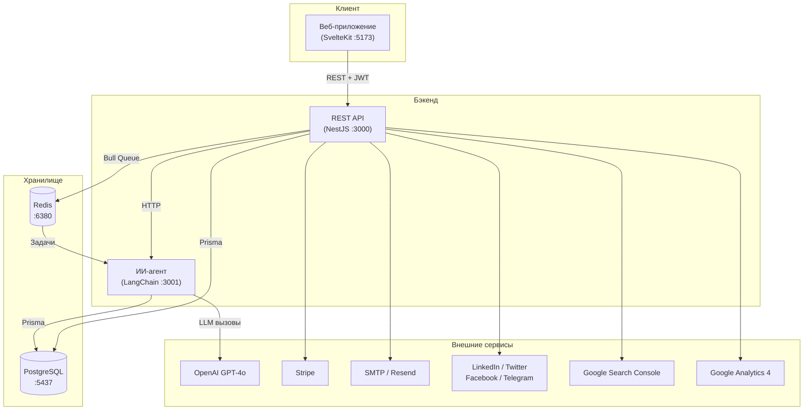
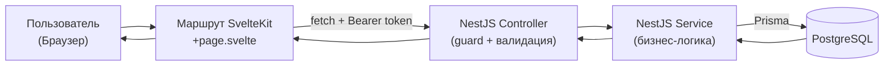
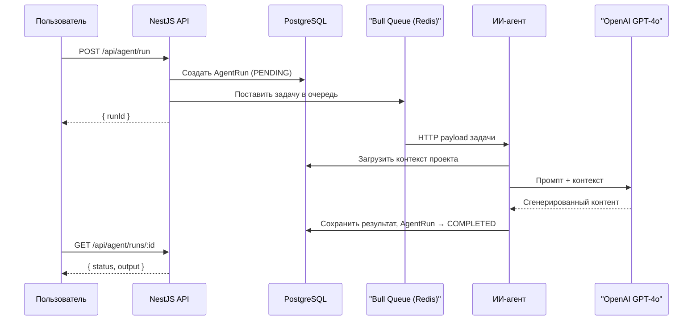
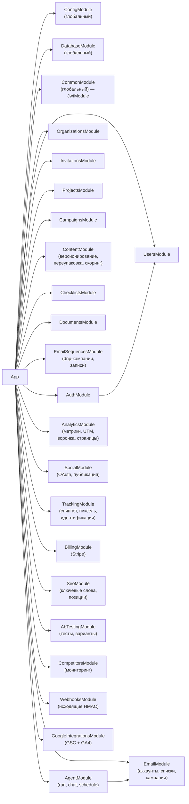
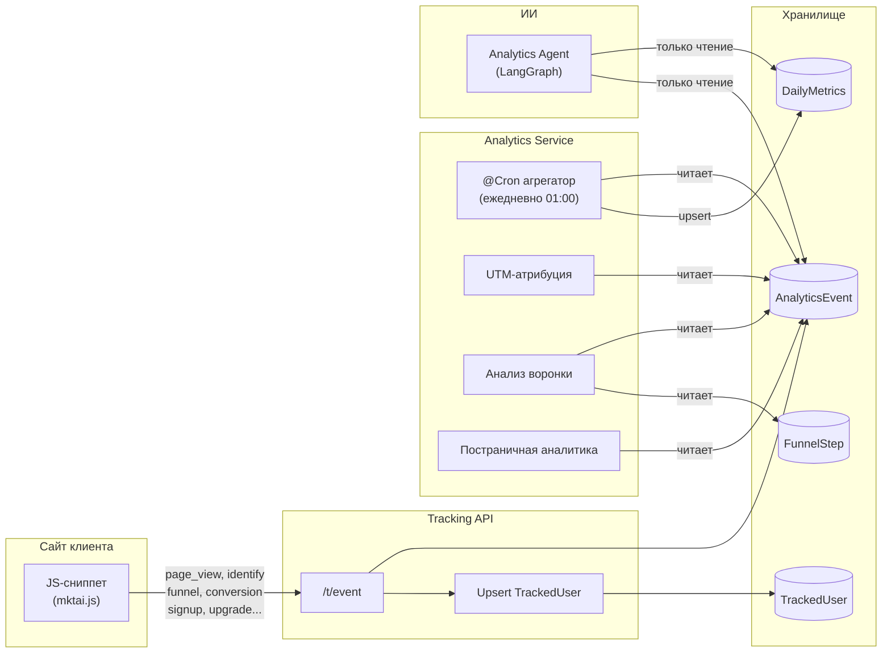
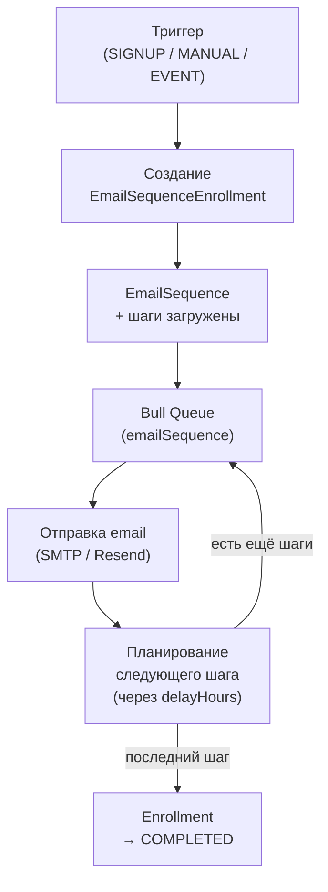

# Обзор архитектуры

Marketing AI Assistant — это Turborepo + pnpm монорепозиторий с тремя приложениями и пятью общими пакетами, созданный специально для маркетинговых команд SaaS и веб-приложений.

## Структура проекта

```
marketing-ai-assistant/
├── apps/
│   ├── api/            # NestJS REST API (порт 3000)
│   ├── web/            # SvelteKit фронтенд (порт 5173)
│   └── ai-agent/       # LangChain/LangGraph микросервис (порт 3001)
├── packages/
│   ├── shared-types/   # TypeScript интерфейсы и перечисления
│   ├── database/       # Prisma схема, клиент, сидинг
│   ├── i18n/           # EN/PL/RU файлы локализации
│   ├── email-templates/# Шаблоны email-компонентов
│   └── config/         # Общие tsconfig, eslint, константы
├── docker-compose.yml  # PostgreSQL, Redis, MailHog
├── turbo.json          # Конфигурация Turbo pipeline
├── pnpm-workspace.yaml # Определение воркспейсов
└── .env.example        # Шаблон переменных окружения
```

## Стек технологий

| Уровень | Технология |
|---------|-----------|
| Фронтенд | SvelteKit 2, Svelte 5, TailwindCSS 3, svelte-i18n |
| Бэкенд API | NestJS 10, Express (Helmet, Compression, CORS) |
| База данных | PostgreSQL 16, Prisma ORM 6 |
| Очередь задач | Bull 4, Redis 7 |
| ИИ/LLM | OpenAI GPT-4o, LangChain, LangGraph, LangSmith |
| Аутентификация | Passport.js (JWT, Local, Google OAuth 2.0), bcrypt |
| Email | Nodemailer (SMTP), Resend API |
| Биллинг | Stripe (Checkout, Portal, Webhooks) |
| Хранилище файлов | AWS S3 (опционально) |
| Валидация | class-validator, Zod |
| Тестирование | Jest, Vitest |
| Сборка | Turborepo, pnpm, TypeScript 5, Vite 6 |
| DevOps | Docker Compose, MailHog |

## Архитектура приложения

### Диаграмма верхнего уровня



### Паттерны взаимодействия

1. **Web ↔ API** — REST через HTTP с JWT Bearer аутентификацией (access-токен 15 мин + refresh-токен 7 дней в HttpOnly cookies)
2. **API → ИИ-агент** — Bull-очередь диспетчеризирует задачи; воркер вызывает ИИ-агент через HTTP
3. **API → PostgreSQL** — Prisma ORM с пулом соединений через синглтон `globalForPrisma`
4. **API → Redis** — Bull-очередь для асинхронной обработки задач ИИ
5. **API → Stripe** — Обработка платежей через Stripe SDK
6. **API → SMTP/Resend** — Транзакционная и массовая рассылка email
7. **API → Социальные платформы** — LinkedIn OAuth2, Twitter API v2, Facebook Graph API v19, Telegram Bot API
8. **API → Google** — Search Console API (SEO данные), GA4 Data API (веб-аналитика)

### Поток данных



### Поток работы ИИ-агента



## Граф зависимостей модулей



## Обзор функциональных модулей

| Модуль | Путь | Описание |
|--------|------|----------|
| Auth | `src/auth/` | JWT, Local, Google OAuth стратегии |
| Users | `src/users/` | Управление профилем |
| Organizations | `src/organizations/` | Мультиарендные организации, роли участников |
| Invitations | `src/invitations/` | Принятие/отклонение приглашений в организацию |
| Projects | `src/projects/` | CRUD проектов, API-ключи, websiteUrl для SEO |
| Campaigns | `src/campaigns/` | Маркетинговые кампании (EMAIL/SOCIAL/BLOG/MULTI_CHANNEL) |
| Content | `src/content/` | CRUD контента, версионирование, переупаковка, оценка эффективности |
| Email | `src/email/` | Аккаунты (SMTP/Resend), списки, подписчики, одноразовые кампании |
| Email Sequences | `src/email-sequences/` | Drip-кампании с триггерами SIGNUP/MANUAL/EVENT и записью участников |
| Checklists | `src/checklists/` | Чек-листы с приоритетами LOW/MEDIUM/HIGH/CRITICAL |
| Documents | `src/documents/` | Структурированные маркетинговые документы |
| Agent | `src/agent/` | Запуски ИИ-агентов, интерактивный чат, управление расписанием |
| Analytics | `src/analytics/` | Дневные метрики, UTM-атрибуция, воронка конверсий, постраничная аналитика |
| Social | `src/social/` | OAuth и ручное подключение соцсетей, публикация контента |
| Tracking | `src/tracking/` | JS-сниппет, пиксель GIF, приём событий, идентификация пользователей |
| Billing | `src/billing/` | Подписки и вебхуки Stripe |
| SEO | `src/seo/` | Отслеживание ключевых слов с историей позиций |
| A/B Testing | `src/ab-testing/` | Эксперименты с темами писем и вариантами контента |
| Competitors | `src/competitors/` | URL конкурентов, периодические снимки, мониторинг изменений |
| Webhooks | `src/webhooks/` | Исходящие вебхуки с HMAC-SHA256 подписью |
| Google Integrations | `src/google-integrations/` | Импорт данных Google Search Console + GA4 |

## Поток данных: Отслеживание и аналитика



## Поток email-автоматизации



## Общие пакеты

| Пакет | Назначение |
|-------|-----------|
| `@marketing-ai/shared-types` | TypeScript интерфейсы, перечисления, DTO для всех приложений |
| `@marketing-ai/database` | Prisma схема + синглтон `globalForPrisma` + скрипт сидинга |
| `@marketing-ai/i18n` | EN/PL/RU JSON-файлы локалей для SvelteKit |
| `@marketing-ai/email-templates` | Переиспользуемые HTML-шаблоны email |
| `@marketing-ai/config` | `tsconfig.base.json`, `eslint.config.js`, общие константы |
