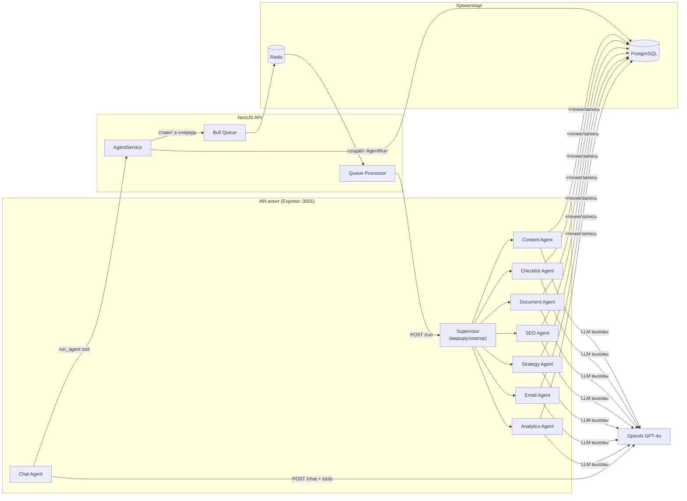
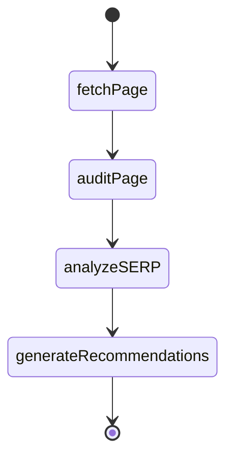
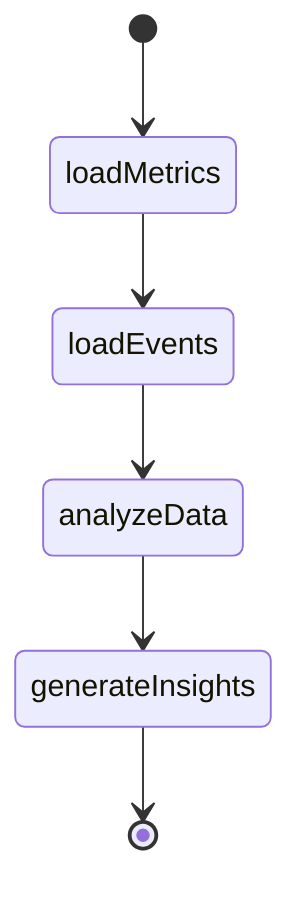
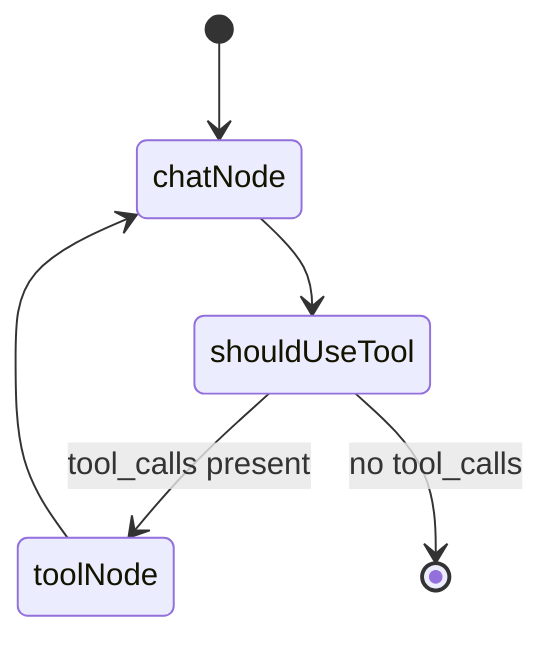

# Система ИИ-агентов

## Обзор

Система ИИ-агентов — это отдельный Express.js микросервис (`apps/ai-agent`), использующий **LangChain**, **LangGraph** и **OpenAI GPT-4o** для генерации маркетингового контента, SEO-аудита, анализа данных и интерактивного чат-ассистента.

## Архитектура



### Поток запроса

1. Клиент вызывает `POST /api/agent/run` с `{ projectId, agentType, input }`
2. API создаёт запись `AgentRun` в БД (статус: `PENDING`)
3. Задача добавляется в Bull-очередь (Redis)
4. Обработчик очереди отправляет HTTP-запрос к `POST /run` ИИ-агента
5. Supervisor маршрутизирует к нужному агенту по `agentType`
6. Агент загружает контекст проекта из БД
7. LangChain/LangGraph обрабатывает запрос через OpenAI GPT-4o
8. Результат сохраняется в БД; `AgentRun` → `COMPLETED`

## Типы агентов

### Content Agent (Контент)

**Файл:** `apps/ai-agent/src/agents/content-agent.ts`

Генерирует маркетинговый контент всех форматов.

**Входные параметры:**
```json
{
  "type": "SOCIAL_POST | BLOG_ARTICLE | EMAIL | NEWSLETTER | AD_COPY | LANDING_PAGE | SEO_ARTICLE | REFERRAL_COPY | IN_APP_MESSAGE",
  "platform": "TWITTER | LINKEDIN | FACEBOOK | INSTAGRAM",
  "topic": "Анонс запуска продукта",
  "keywords": ["инновации", "технологии"],
  "tone": "professional | casual | humorous | formal",
  "length": "short | medium | long"
}
```

**Поведение:**
- Загружает контекст проекта (название, аудитория, голос бренда, отрасль)
- Для `SEO_ARTICLE`: SERP-анализ, генерирует `metaTitle`, `metaDescription`, `suggestedSlug`, `keywordDensity`
- Для `LANDING_PAGE`: структурированный JSON (hero, features, social proof, pricing CTA, FAQ)
- Модель: GPT-4o, температура: 0.8
- Создаёт запись Content в БД

### Checklist Agent (Чек-листы)

**Файл:** `apps/ai-agent/src/agents/checklist-agent.ts`

Генерирует чек-листы маркетинговых задач.

**Типы:** `LAUNCH`, `WEEKLY`, `CAMPAIGN_PREP`, `SEO`, `SOCIAL_MEDIA`, `EMAIL_CAMPAIGN`, `PRODUCT_HUNT_LAUNCH`

### Document Agent (Документы)

**Файл:** `apps/ai-agent/src/agents/document-agent.ts`

Генерирует маркетинговые документы.

**Типы:** `MARKETING_PLAN`, `REPORT`, `COMPETITIVE_ANALYSIS`, `BRAND_GUIDELINES`, `CONTENT_CALENDAR`, `PRODUCT_HUNT_BRIEF`

`PRODUCT_HUNT_BRIEF` включает: tagline, описание, комментарий мейкера, посты для дня запуска.

### SEO Agent

**Файл:** `apps/ai-agent/src/agents/seo-agent.ts`

SEO-аудит страниц и анализ конкурентов в SERP с использованием LangGraph.

**Граф состояний LangGraph:**



**Результат:** аудит title/meta/H1-H2, плотность ключевых слов, сравнение с конкурентами в выдаче, приоритизированные рекомендации.

### Strategy Agent (Стратегия)

**Файл:** `apps/ai-agent/src/agents/strategy-agent.ts`

Генерирует стратегии выхода на рынок, планирование продвижения, анализ позиционирования.

**Типы:** `GTM`, `POSITIONING`, `PRODUCT_HUNT`, `PRICING`

### Email Agent (Email)

**Файл:** `apps/ai-agent/src/agents/email-agent.ts`

Генерирует email-копирайтинг и полные drip-последовательности.

**Типы:**
- `SUBJECT_LINE` — несколько вариантов для A/B тестирования
- `CAMPAIGN_EMAIL` — полное письмо (тема + preheader + тело + CTA)
- `SEQUENCE` — вся drip-последовательность (N писем с тайминг-рекомендациями)

### Analytics Agent (Аналитика)

**Файл:** `apps/ai-agent/src/agents/analytics-agent.ts`

Анализирует маркетинговые данные и генерирует выводы на естественном языке.

**Граф состояний LangGraph:**



**Поведение:**
- Запросы только на чтение к `DailyMetrics` и `AnalyticsEvent`
- Анализ трендов, сравнение каналов, обнаружение аномалий
- Генерация еженедельных дайджестов
- Ответы на вопросы типа «Почему упал трафик?» или «Какой канал самый эффективный?»

### Chat Agent (Чат)

**Файл:** `apps/ai-agent/src/agents/chat-agent.ts`

Интерактивный ИИ маркетинговый ассистент с возможностью вызова инструментов.

**Входные параметры:**
```json
{
  "message": "Создай чек-лист для запуска продукта",
  "projectId": "clx...",
  "userId": "clx...",
  "history": [
    { "role": "user", "content": "..." },
    { "role": "assistant", "content": "..." }
  ]
}
```

**Граф состояний LangGraph:**



**Инструмент: `run_agent`**

Чат-агент может запускать любого специализированного агента прямо из диалога:

| Поле | Тип | Описание |
|------|-----|----------|
| agentType | enum | CONTENT, CHECKLIST, DOCUMENT, STRATEGY, SEO, EMAIL, ANALYTICS |
| topic | string? | Основная тема |
| type | string? | Подтип (например, SOCIAL_POST, LAUNCH, GO_TO_MARKET) |
| platform | string? | Целевая платформа (LINKEDIN, TWITTER и др.) |
| description | string? | Подробные инструкции |
| language | string? | Язык результата (en, pl, ru) |

Инструмент вызывает `POST /api/agent/run-internal` с заголовком `X-Agent-Secret` и возвращает подтверждение с прямой ссылкой на страницу результатов.

**Поведение:**
- Модель: GPT-4o, температура: 0.7
- Загружает контекст проекта при наличии `projectId`
- Цикл вызова инструментов: OpenAI решает, когда использовать инструмент `run_agent`
- Поддерживает EN/PL/RU мультиязычные ответы (как в чате, так и в результатах агента)
- Поддерживает историю диалога от клиента
- Сообщения поддерживают рендеринг Markdown на фронтенде

### Supervisor (Диспетчер)

**Файл:** `apps/ai-agent/src/agents/supervisor.ts`

Маршрутизатор задач.
- Получает `{ runId, projectId, agentType, input }`
- Маршрутизирует к нужному агенту
- Замеряет время выполнения и расход токенов
- Обновляет `AgentRun` в БД

## Конфигурация

### Переменные окружения

```env
OPENAI_API_KEY="sk-your-openai-api-key"
OPENAI_MODEL="gpt-4o"
AI_AGENT_PORT="3001"

# Трассировка LangSmith (рекомендуется)
LANGSMITH_API_KEY="your-langsmith-api-key"
LANGSMITH_PROJECT="marketing-ai-assistant"
LANGCHAIN_TRACING_V2="true"

# Внутренний запуск агентов
AGENT_SECRET="your-secret-key"    # Общий секрет для запуска агентов из чата
```

### Зависимости

| Пакет | Назначение |
|-------|-----------|
| `@langchain/core` | Базовые сообщения |
| `@langchain/openai` | Обёртка ChatOpenAI |
| `@langchain/langgraph` | Граф-ориентированные рабочие процессы |
| `@langchain/community` | TavilySearch, CheerioWebBaseLoader для SEO-агента |
| `langsmith` | Трассировка и мониторинг |

## Эндпоинты API (микросервис ИИ-агента)

### POST `/run`

Выполнить задачу агента.

**Запрос:**
```json
{
  "runId": "clx...",
  "projectId": "clx...",
  "agentType": "CONTENT",
  "input": { ... }
}
```

### POST `/chat`

Интерактивный чат с ИИ-ассистентом.

**Запрос:**
```json
{
  "message": "Создай чек-лист для запуска продукта",
  "projectId": "clx...",
  "userId": "clx...",
  "history": []
}
```

### GET `/health`

Проверка работоспособности.

## Отслеживание стоимости

Каждая запись `AgentRun` хранит:
- **tokensUsed** — суммарное количество токенов
- **cost** — оценочная стоимость в USD
- **duration** — время выполнения (мс)
- **langsmithTraceUrl** — ссылка на трассировку LangSmith

## Запланированные запуски

Модель `AgentSchedule` обеспечивает автоматизацию по cron:
- cron-выражение + тип агента на каждый проект
- Флаг `isActive` для включения/отключения
- Обработчик проверяет `isActive && nextRunAt <= now()` при каждом тике @Cron
- `lastRunAt` / `nextRunAt` для отслеживания расписания
