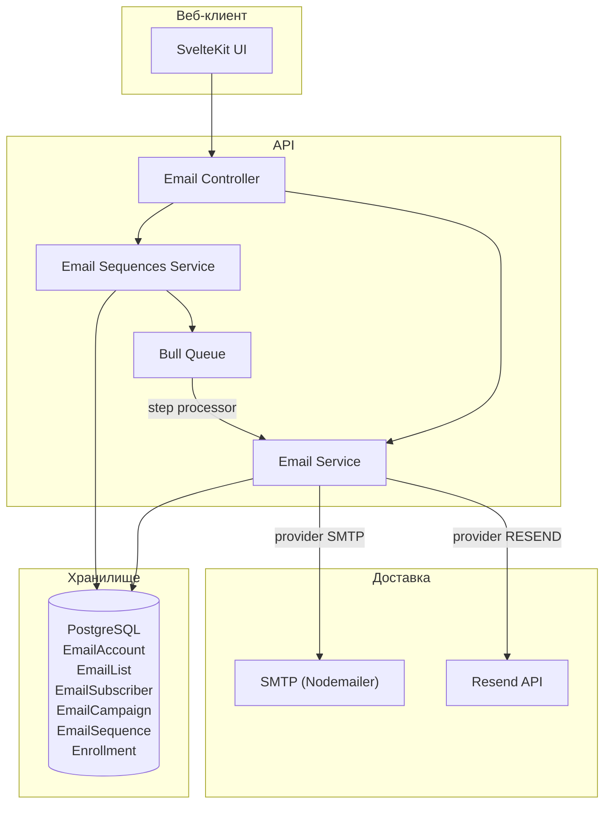
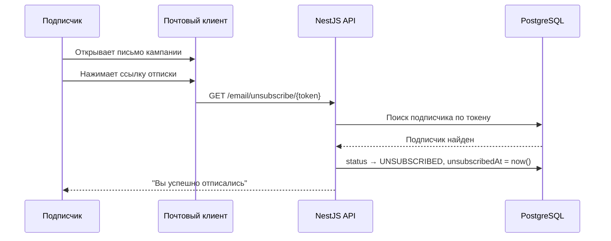
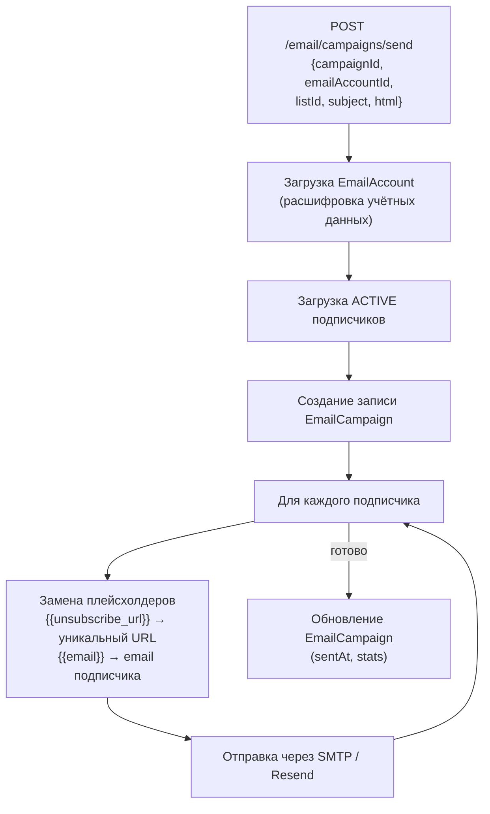
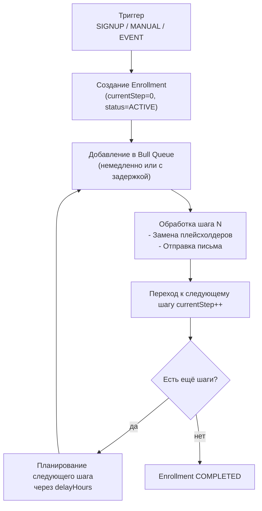

# Система email-маркетинга

## Обзор

Система email поддерживает два провайдера (**SMTP** и **Resend**), управление списками подписчиков, отправку разовых кампаний с заменой плейсхолдеров, автоматизированные drip-последовательности и отписку в один клик.

## Архитектура



## API-маршруты

| Метод | Маршрут | Доступ | Описание |
|-------|---------|--------|----------|
| GET | `/email/accounts?organizationId=<id>` | Защищён | Список email-аккаунтов |
| POST | `/email/accounts` | Защищён | Создать email-аккаунт |
| DELETE | `/email/accounts/:id` | Защищён | Удалить email-аккаунт |
| POST | `/email/accounts/:id/test` | Защищён | Проверить подключение |
| GET | `/email/lists?projectId=<id>` | Защищён | Список рассылок |
| POST | `/email/lists` | Защищён | Создать список рассылки |
| DELETE | `/email/lists/:id` | Защищён | Удалить список рассылки |
| GET | `/email/lists/:listId/subscribers` | Защищён | Получить подписчиков |
| POST | `/email/lists/:listId/subscribers` | Защищён | Добавить/обновить подписчика |
| DELETE | `/email/lists/:listId/subscribers/:id` | Защищён | Удалить подписчика |
| GET | `/email/unsubscribe/:token` | **Публичный** | Отписаться по токену |
| GET | `/email/campaigns?projectId=<id>` | Защищён | Список кампаний |
| POST | `/email/campaigns/send` | Защищён | Отправить кампанию |
| POST | `/email/sequences` | Защищён | Создать последовательность |
| GET | `/email/sequences?projectId=<id>` | Защищён | Список последовательностей |
| GET | `/email/sequences/:id` | Защищён | Получить последовательность с шагами |
| PUT | `/email/sequences/:id` | Защищён | Обновить последовательность |
| DELETE | `/email/sequences/:id` | Защищён | Удалить последовательность |
| POST | `/email/sequences/:id/enroll` | Защищён | Подписать пользователя на последовательность |

## Email-аккаунты

### Типы провайдеров

| Провайдер | Конфигурация |
|-----------|-------------|
| SMTP | хост, порт, пользователь, пароль (хранится в зашифрованном виде AES-256-CBC) |
| Resend | API-ключ (хранится в зашифрованном виде AES-256-CBC) |

### Шифрование учётных данных

Учётные данные email-аккаунтов шифруются при хранении с помощью **AES-256-CBC**:
- Ключ шифрования: переменная окружения `ENCRYPTION_KEY` (32-байтовая hex-строка)
- Хранится в колонке `encryptedCredentials`
- Расшифровывается «на лету» при отправке писем

## Управление подписчиками

### Статусы

| Статус | Описание |
|--------|----------|
| ACTIVE | Подписан, может получать письма |
| UNSUBSCRIBED | Отписался через ссылку отписки |
| BOUNCED | Доставка письма постоянно не удаётся |

### Процесс отписки



## Отправка кампаний

### Процесс отправки



### Плейсхолдеры шаблонов

| Плейсхолдер | Заменяется на |
|-------------|---------------|
| `{{unsubscribe_url}}` | `{API_URL}/email/unsubscribe/{token}` |
| `{{email}}` | Email-адрес подписчика |

## Email-последовательности (Drip-кампании)

Email-последовательности позволяют создавать автоматизированные многошаговые email-потоки, запускаемые событиями подписчиков.

### Процесс выполнения последовательности



### Типы триггеров

| Триггер | Описание |
|---------|----------|
| SIGNUP | Автоматически подписывает новых подписчиков при добавлении в список |
| MANUAL | Ручная подписка конкретного подписчика |
| EVENT | Запускается аналитическим событием (например, TRIAL_START) |

### Встроенные шаблоны последовательностей

| Шаблон | Шагов | Применение |
|--------|-------|------------|
| Welcome Series | 5 писем | Онбординг новых пользователей |
| Trial Nurture | 7 писем | Конвертация триала в платную подписку |
| Re-engagement | 3 письма | Возврат неактивных пользователей |

### Пример последовательности

```json
{
  "name": "Trial Nurture",
  "trigger": "SIGNUP",
  "steps": [
    { "order": 1, "subject": "Welcome to [Product]!", "delayHours": 0 },
    { "order": 2, "subject": "Get started in 5 minutes", "delayHours": 24 },
    { "order": 3, "subject": "Key feature you might have missed", "delayHours": 72 },
    { "order": 4, "subject": "Your trial ends in 3 days", "delayHours": 168 },
    { "order": 5, "subject": "Last chance — upgrade now", "delayHours": 240 }
  ]
}
```

## Настройка для разработки

### MailHog (Локальный SMTP)

MailHog включён в `docker-compose.yml` для локального тестирования email:

- **SMTP порт:** 1025
- **Веб-интерфейс:** http://localhost:8025

Все письма, отправленные через SMTP в режиме разработки, перехватываются MailHog и отображаются в веб-интерфейсе.

### Конфигурация

```env
# SMTP (разработка — MailHog)
SMTP_HOST="localhost"
SMTP_PORT="1025"
SMTP_SECURE="false"
SMTP_USER=""
SMTP_PASS=""

# Resend (продакшен)
RESEND_API_KEY="re_your-resend-api-key"
RESEND_FROM_EMAIL="noreply@yourdomain.com"

# Ключ шифрования для учётных данных email-аккаунтов (32-байтовая hex-строка)
ENCRYPTION_KEY="0000000000000000000000000000000000000000000000000000000000000000"
```
