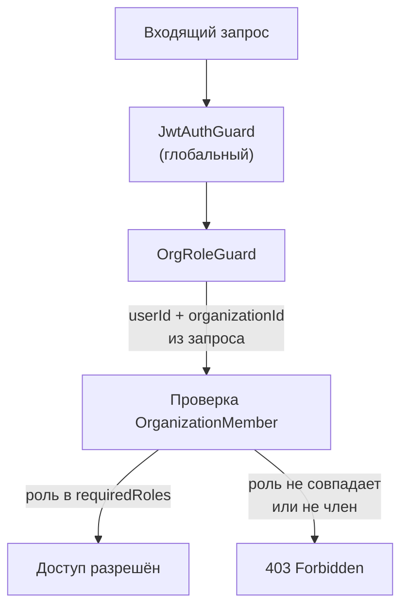
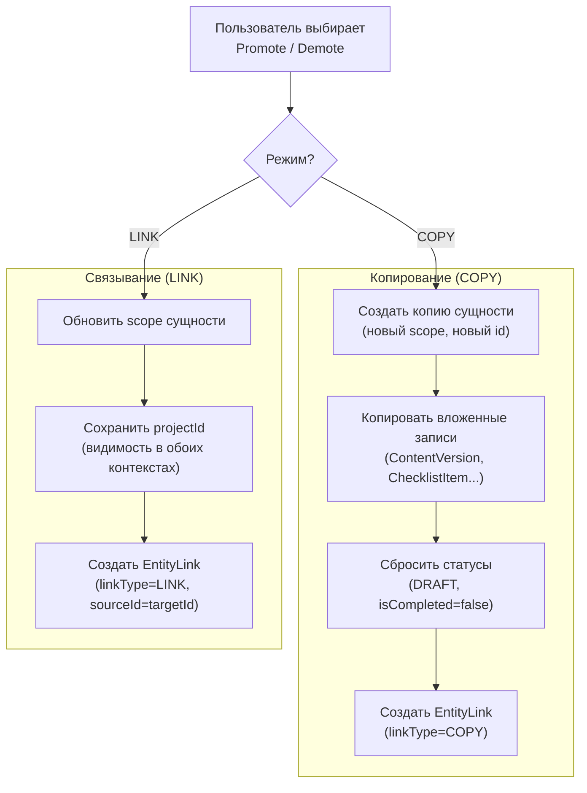

# Маркетинговые разделы на уровне организации

Функция организационного уровня маркетинга добавляет полноценные маркетинговые разделы (Контент, Чек-листы, Документы, Кампании, Email, Аналитика, SEO, Конкуренты, Эксперименты, Последовательности, Календарь) на уровне организации — зеркально повторяя структуру проектных разделов. Включает агрегированные представления данных по всем проектам и механизм продвижения/понижения сущностей между областями видимости.

## Обзор

До этой функции все маркетинговые сущности (контент, чек-листы, документы и т. д.) существовали исключительно в рамках проекта. Организационный уровень решает три задачи:

1. **Организационные сущности** — маркетинговые объекты, существующие независимо от проектов
2. **Агрегированные дашборды** — сводные данные по всем проектам организации
3. **Продвижение/Понижение (Promote/Demote)** — двунаправленное перемещение сущностей между проектным и организационным уровнями (копирование или связывание)
4. **Сравнение проектов** — аналитика с возможностью сравнения метрик нескольких проектов
5. **Ролевой доступ** — OWNER/ADMIN видят всё, MEMBER видит только свои проекты и связанные с ними сущности организации

---

## Руководство пользователя

### Навигация по разделам организации

После обновления боковая панель (Sidebar) содержит два уровня маркетинговых разделов:

```
── Название организации (переключатель)
│
├─ Дашборд (сводка организации)
├─ Контент
├─ Чек-листы
├─ Документы
├─ Кампании
├─ Email
├─ Аналитика
├─ SEO
├─ Конкуренты
├─ Эксперименты
├─ Последовательности
├─ Календарь
├─ ИИ-чат
├─ Проекты
│   └─ [выбранный проект]
│       ├─ Обзор
│       ├─ Контент
│       ├─ Чек-листы
│       ├─ Email
│       ├─ Кампании
│       ├─ ▾ Расширенное
│       │   ├─ Документы
│       │   ├─ Аналитика
│       │   ├─ SEO
│       │   ├─ Эксперименты
│       │   ├─ Последовательности
│       │   ├─ Конкуренты
│       │   └─ Календарь
│       └─ Настройки
│
└─ Настройки
    ├─ Организация
    ├─ Биллинг
    ├─ Команда
    ├─ Email-аккаунты
    ├─ Интеграции
    └─ Вебхуки
```

Маркетинговые разделы организации расположены в боковой панели сразу после основных ссылок (Дашборд, Проекты, ИИ-чат, Шаблоны) и перед блоком настроек. Разделы проекта доступны при выборе конкретного проекта.

### Организация vs Проект — области видимости

Каждая маркетинговая сущность имеет поле `scope` (область видимости):

| Область | Описание | `projectId` | `organizationId` |
|---------|----------|-------------|-------------------|
| `PROJECT` | Привязана к конкретному проекту | Обязателен | Обязателен (заполняется автоматически) |
| `ORGANIZATION` | Существует на уровне организации | `null` или задан (для связанных) | Обязателен |

**Правила:**
- `scope = PROJECT` — сущность принадлежит проекту. `projectId` обязателен.
- `scope = ORGANIZATION` + `projectId = null` — чистая организационная сущность, видна только в разделах организации.
- `scope = ORGANIZATION` + `projectId != null` — связанная сущность (LINK), видна **и** в проекте, **и** в организации.

### Использование вкладок (Организация / Все проекты / Сравнение)

Каждая страница организационного уровня содержит вкладки:

| Вкладка | Содержимое |
|---------|-----------|
| **Организация** | Только сущности с `scope = ORGANIZATION` |
| **Все проекты** | Агрегация из всех проектов + организационные сущности, с фильтром проектов (мультиселект) |
| **Сравнение** | Только для Аналитики — сравнение метрик проектов бок о бок |

Вкладки доступны по следующим маршрутам:

```
/content              → организационный контент
/checklists           → организационные чек-листы
/documents            → организационные документы
/campaigns            → организационные кампании
/email                → организационный email
/analytics            → организационная аналитика (сводка + сравнение)
/seo                  → организационное SEO
/competitors          → организационные конкуренты
/experiments          → организационные эксперименты
/sequences            → организационные последовательности
/calendar             → организационный календарь (все проекты)
```

Проектные маршруты не изменились: `/projects/[id]/content` и т. д.

### Продвижение контента в организацию (Promote)

Продвижение переносит проектную сущность на организационный уровень. Доступно через контекстное меню (`...`) на любой сущности в проекте.

**Два режима:**

| Режим | Поведение | После продвижения |
|-------|----------|-------------------|
| **Копия (Copy)** | Создаётся новая сущность с `scope = ORGANIZATION`, `projectId = null` | Два независимых объекта. Изменения в одном не влияют на другой |
| **Ссылка (Link)** | Та же сущность. `scope` меняется на `ORGANIZATION`, `projectId` сохраняется | Один объект, видимый в обоих контекстах |

**Что копируется при режиме Copy:**

| Сущность | Копируемые дочерние записи | Сбрасываемые поля |
|----------|---------------------------|-------------------|
| Content | Последняя ContentVersion | `status` → DRAFT |
| Checklist | Все ChecklistItem | `isCompleted` → false |
| Document | Нет (тот же fileUrl) | — |
| Campaign | Нет (EmailCampaign НЕ копируется) | `status` → DRAFT |
| EmailList | Нет (подписчики НЕ копируются) | — |
| Keyword | Нет (история позиций НЕ копируется) | — |
| Competitor | Нет (снимки НЕ копируются) | — |
| AnalyticsEvent | Нет | — |
| ABTest | ABTestVariant (сброс счётчиков) | `status` → DRAFT |
| EmailSequence | EmailSequenceStep (без записей) | — |

### Назначение контента в проект (Demote)

Назначение переносит организационную сущность в конкретный проект. Доступно через контекстное меню на организационных страницах.

**Два режима:**

| Режим | Поведение |
|-------|----------|
| **Копия (Copy)** | Новая сущность с `scope = PROJECT` в выбранном проекте |
| **Ссылка (Link)** | Та же сущность — `projectId` устанавливается, `scope` остаётся `ORGANIZATION`. Видна в обоих контекстах |

При назначении пользователь выбирает целевой проект в модальном окне.

### Удаление связей

Удаление связи (EntityLink) ведёт себя по-разному в зависимости от типа:

- **COPY** — удаляется только запись о связи. Копии остаются как независимые сущности.
- **LINK** — пользователь выбирает, где оставить сущность (в проекте или в организации). Вторая сторона теряет видимость.

### Агрегированная аналитика

Страница организационной аналитики (`/analytics`) предоставляет:

**Режим сводки (по умолчанию):**
- Итоги: созданный контент, отправленные письма, просмотры страниц, конверсии — суммарно по всем проектам
- Графики временных рядов (7 / 30 / 90 дней) с линиями по каждому проекту
- Лучшие результаты: лучший контент, лучшая кампания, лучшее письмо — по всей организации
- Фильтры: период, проекты (мультиселект), тип контента

**Режим сравнения:**
- Таблица: проекты как строки, метрики как столбцы (контент, open rate, просмотры, конверсии, позиции ключевых слов)
- Графики: до 5 проектов на одном графике
- Выбор метрик для сравнения

### Календарь организации

Календарь (`/calendar`) — агрегированное представление, не отдельная модель Prisma:

- Объединённый календарь с сущностями из всех проектов + организационных
- Цветовая кодировка по проекту (организационные сущности выделены отдельным цветом)
- Фильтрация по проектам и типам сущностей (контент, кампании, email)
- Клик по элементу ведёт к сущности (в проектном или организационном контексте)

### Права доступа по ролям

| Действие | OWNER | ADMIN | MEMBER |
|----------|-------|-------|--------|
| Просмотр организационных сущностей | Все | Все | Только связанные с его проектами |
| Агрегированные данные | Все проекты | Все проекты | Только свои проекты |
| Создание организационных сущностей | Да | Да | Нет |
| Promote (продвижение) | Да | Да | Только свои сущности |
| Demote (назначение) | Да | Да | Только в свои проекты |
| Сравнение проектов | Все проекты | Все проекты | Только свои проекты |

---

## Техническая документация

### Модель данных

#### Enum EntityScope

```prisma
enum EntityScope {
  PROJECT
  ORGANIZATION
}
```

Определяет область видимости сущности. Все существующие записи при миграции получают значение `PROJECT`.

#### Поля scope в моделях

Все 10 основных маркетинговых моделей получили три новых поля:

```prisma
model Content {
  // ... существующие поля
  scope          EntityScope   @default(PROJECT)
  organizationId String?
  projectId      String?       // было обязательным, стало опциональным

  organization   Organization? @relation(fields: [organizationId], references: [id])
  project        Project?      @relation(fields: [projectId], references: [id], onDelete: SetNull)

  @@index([scope, organizationId])
  @@index([scope, projectId])
  @@index([organizationId])
}
```

**Важно:** связь с Project изменена с `onDelete: Cascade` на `onDelete: SetNull`. При удалении проекта:
- Проектные сущности (`scope = PROJECT`) получают `projectId = null` — задача очистки удаляет осиротевшие записи
- Связанные сущности (`scope = ORGANIZATION`) получают `projectId = null` — остаются как организационные

#### Модель EntityLink

```prisma
enum EntityLinkType {
  COPY
  LINK
}

enum EntityModelType {
  CONTENT
  CHECKLIST
  DOCUMENT
  CAMPAIGN
  EMAIL_LIST
  KEYWORD
  COMPETITOR
  ANALYTICS_EVENT
  AB_TEST
  EMAIL_SEQUENCE
}

model EntityLink {
  id          String          @id @default(cuid())
  entityType  EntityModelType
  sourceId    String
  targetId    String
  linkType    EntityLinkType
  sourceScope EntityScope
  targetScope EntityScope
  createdBy   String
  createdAt   DateTime        @default(now())

  creator User @relation(fields: [createdBy], references: [id])

  @@index([entityType, sourceId, targetId])
  @@index([entityType, targetId])
  @@map("entity_links")
}
```

**Поведение полей sourceId / targetId:**

| Тип связи | sourceId | targetId | Описание |
|-----------|----------|----------|----------|
| `COPY` | ID оригинала | ID новой копии | Независимые сущности после создания |
| `LINK` | ID сущности | ID сущности (= sourceId) | Одна сущность, видимая в двух контекстах |

#### Затронутые модели

**Основные модели** (получают `scope`, `organizationId`, опциональный `projectId`):

| Модель | Файл схемы | Дочерние модели (наследуют scope) |
|--------|-----------|----------------------------------|
| `Content` | `schema.prisma` | `ContentVersion` |
| `Checklist` | `schema.prisma` | `ChecklistItem` |
| `Document` | `schema.prisma` | — |
| `Campaign` | `schema.prisma` | `EmailCampaign` |
| `EmailList` | `schema.prisma` | `EmailSubscriber` |
| `Keyword` | `schema.prisma` | `KeywordRankHistory` |
| `Competitor` | `schema.prisma` | `CompetitorSnapshot` |
| `AnalyticsEvent` | `schema.prisma` | — |
| `ABTest` | `schema.prisma` | `ABTestVariant` |
| `EmailSequence` | `schema.prisma` | `EmailSequenceStep`, `EmailSequenceEnrollment` |

**Модели без собственного scope** (агрегируются через JOIN):
- `DailyMetrics`, `FunnelStep`, `TrackedUser` — через `Project.organizationId`

**Модели вне scope** (остаются только проектными):
- `AgentRun`, `AgentSchedule` — ИИ-агенты работают только в контексте проекта

#### Изменения уникальных ограничений

| Модель | Старое ограничение | Новое ограничение |
|--------|-------------------|-------------------|
| `Keyword` | `@@unique([projectId, keyword])` | + `@@unique([organizationId, keyword])` |
| `Competitor` | `@@unique([projectId, websiteUrl])` | + `@@unique([organizationId, websiteUrl])` |
| `DailyMetrics` | `@@unique([projectId, date])` | Без изменений (только проектный уровень) |
| `AgentSchedule` | `@@unique([projectId, agentType])` | Без изменений (только проектный уровень) |

### API эндпоинты

#### Scope-aware запросы

Все 10 основных маркетинговых контроллеров поддерживают унифицированный паттерн запросов:

```
GET /<сущность>?projectId=X
  → проектные сущности (scope=PROJECT AND projectId=X)
  + связанные сущности (scope=ORGANIZATION AND projectId=X)

GET /<сущность>?organizationId=X
  → только организационные (scope=ORGANIZATION AND organizationId=X)

GET /<сущность>?organizationId=X&aggregated=true
  → все: организационные + все проекты пользователя
```

**Важно:** запрос `?projectId=X` включает связанные сущности. SQL-условие:

```sql
WHERE "projectId" = X AND ("scope" = 'PROJECT' OR "scope" = 'ORGANIZATION')
```

Это гарантирует, что LINK-сущности (с `scope = ORGANIZATION`, но ненулевым `projectId`) появляются как в проектном, так и в организационном представлении.

Параметр `aggregated=true` использует JWT-контекст аутентифицированного пользователя для определения видимых проектов. Для роли MEMBER фильтрация ограничена проектами, в которых пользователь является участником. Параметр `organizationId` обязателен для предотвращения утечки данных между организациями.

Существующие вызовы `?projectId=X` полностью обратно совместимы.

#### Entity Links API

Модуль: `apps/api/src/entity-links/`

| Метод | Путь | Описание | Роли |
|-------|------|----------|------|
| `POST` | `/api/entity-links/promote` | Продвижение сущности проекта на уровень организации | OWNER, ADMIN |
| `POST` | `/api/entity-links/demote` | Назначение организационной сущности в проект | OWNER, ADMIN |
| `GET` | `/api/entity-links?entityType=X&entityId=Y` | Получить все связи для сущности | Все |
| `DELETE` | `/api/entity-links/:id` | Удалить связь | OWNER, ADMIN |

**DTO Promote:**

```typescript
{
  entityType: 'CONTENT' | 'CHECKLIST' | 'DOCUMENT' | 'CAMPAIGN' | 'EMAIL_LIST'
              | 'KEYWORD' | 'COMPETITOR' | 'ANALYTICS_EVENT' | 'AB_TEST' | 'EMAIL_SEQUENCE';
  entityId: string;
  organizationId: string;
  linkType: 'COPY' | 'LINK';
}
```

**DTO Demote:**

```typescript
{
  entityType: string;   // те же значения, что и Promote
  entityId: string;
  organizationId: string;
  projectId: string;    // целевой проект
  linkType: 'COPY' | 'LINK';
}
```

**Логика promote (LINK):**
1. Обновление сущности: `scope` → `ORGANIZATION`, установка `organizationId`
2. `projectId` сохраняется — сущность видна в обоих контекстах
3. Создание записи `EntityLink` с `sourceId = targetId`

**Логика promote (COPY):**
1. Создание новой сущности: копируются все поля кроме `id`, `projectId`, `scope`, `createdAt`, `updatedAt`
2. Новая запись: `scope = ORGANIZATION`, `projectId = null`
3. Копирование вложенных связей (ContentVersion, ChecklistItem и т. д.)
4. Создание записи `EntityLink` с `sourceId` = оригинал, `targetId` = копия

**Логика deleteLink:**
- Для `COPY`: удаление записи EntityLink (копии остаются независимыми)
- Для `LINK`: откат `scope` сущности к исходному значению. Если сущность была продвинута (promoted), `scope` возвращается к `PROJECT`. Если была назначена (demoted), `scope` возвращается к `ORGANIZATION` и `projectId` обнуляется.

#### Аналитика организации

Контроллер: `apps/api/src/analytics/analytics.controller.ts`

| Метод | Путь | Описание |
|-------|------|----------|
| `GET` | `/api/analytics/organization?organizationId=X&period=30d` | Сводка аналитики организации |
| `GET` | `/api/analytics/organization/compare?projectIds=A,B,C&period=30d` | Сравнение проектов |

Все существующие эндпоинты аналитики (`metrics/totals`, `metrics`, `summary`, `utm-breakdown`, `funnel`, `pages`) поддерживают новые параметры:

```
GET /api/analytics/metrics?organizationId=X                → организационные метрики
GET /api/analytics/metrics?organizationId=X&aggregated=true → агрегация по всем проектам
GET /api/analytics/metrics?projectId=X                      → проектные метрики (как раньше)
```

Обязательное условие: один из параметров `projectId` или `organizationId` должен быть указан, иначе — `400 Bad Request`.

### Guards и авторизация

Для организационных эндпоинтов используется `OrgRoleGuard` (`apps/api/src/common/guards/org-role.guard.ts`):



**Механизм работы:**

1. `JwtAuthGuard` (глобальный) извлекает `userId` из JWT-токена
2. `OrgRoleGuard` читает `organizationId` из `query` или `body` запроса
3. Ищет запись `OrganizationMember` по `userId` + `organizationId`
4. Проверяет, что роль участника входит в список `requiredRoles` (задаётся через декоратор `@OrgRoles('OWNER', 'ADMIN')`)
5. При несовпадении — `403 Forbidden`

Декоратор `@OrgRoles()` применён к эндпоинтам `promote`, `demote` и `deleteLink` в `EntityLinksController`.

### Заметки о миграции

Миграция выполняется в 7 шагов:

**Шаг 1.** Добавление enum `EntityScope` и новых полей в 10 моделей:
- `scope EntityScope @default(PROJECT)` — все существующие записи получат `PROJECT`
- `organizationId String?` — `null` для существующих записей
- `projectId` — меняется с обязательного на опциональный

**Шаг 2.** Обратная миграция данных — заполнение `organizationId`:

```sql
UPDATE "Content" SET "organizationId" = (
  SELECT p."organizationId" FROM "Project" p WHERE p.id = "Content"."projectId"
) WHERE "organizationId" IS NULL;
-- Повторить для всех 10 таблиц
```

**Шаг 3.** Изменение `onDelete: Cascade` на `onDelete: SetNull` для связи с Project во всех 10 основных моделях.

**Шаг 4.** Добавление организационных уникальных ограничений:
- `@@unique([organizationId, keyword])` для Keyword
- `@@unique([organizationId, websiteUrl])` для Competitor

**Шаг 5.** Создание таблицы `EntityLink` с enum-типами `EntityModelType` и `EntityLinkType`.

**Шаг 6.** Добавление индексов:
- `@@index([scope, organizationId])` — на все 10 таблиц
- `@@index([scope, projectId])` — на все 10 таблиц
- `@@index([organizationId])` — на все 10 таблиц

**Шаг 7.** Задача очистки: удаление осиротевших записей с `scope = PROJECT` и `projectId IS NULL` (защита от некорректных данных).

**Обратная совместимость:**
- Все существующие вызовы `?projectId=X` работают без изменений
- Параметры `?organizationId=X` и `?aggregated=true` — новый opt-in функционал
- Нет ломающих изменений в существующих API-контрактах

**Выполнение миграции:**

```bash
cd packages/database && pnpm db:migrate:dev    # создание миграции (dev)
pnpm db:migrate                                 # применение миграции (production)
pnpm db:generate                                # перегенерация Prisma-клиента
```

### Диаграмма потока Promote/Demote



### Ограничения

- **LINK:** одна сущность может быть связана максимум с одним проектом + уровнем организации (не с несколькими проектами)
- **COPY:** количество копий не ограничено
- **ИИ-агенты:** запуски агентов остаются только на уровне проекта (`AgentRun`, `AgentSchedule`). Организационные запуски агентов — за рамками текущей реализации
- **Командный уровень scope** (Team), кросс-организационный обмен и гранулярные ACL на уровне сущностей — не реализованы
